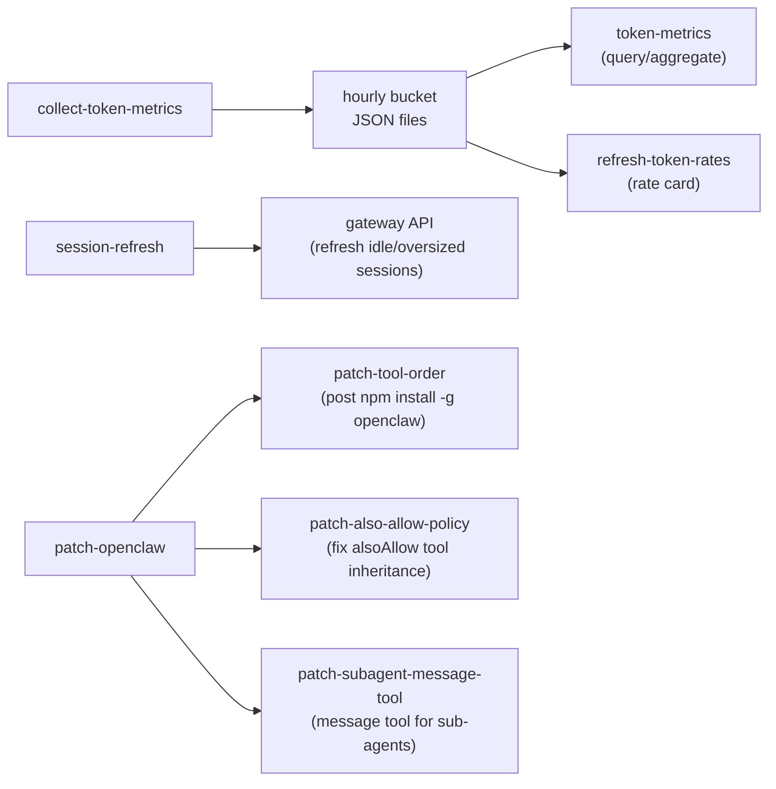

# admin/

Token metrics collection, session cost management, and OpenClaw post-install patches.

## Scripts

| Script | Description |
| --- | --- |
| `collect-token-metrics.ts` | Scans OpenClaw session transcripts and Claude Code session logs, writes immutable hourly rollup buckets to disk |
| `session-refresh.ts` | Rotates bloated gateway sessions by resetting idle sessions with high cacheRead values |
| `token-metrics.ts` | Queries pre-rolled hourly buckets and aggregates into a cost report for a given time range (also a CLI: `tsx src/admin/token-metrics.ts [--from ISO] [--to ISO]`) |
| `refresh-token-rates.ts` | Dispatches an LLM session to fetch current published API pricing and update the rate card config |
| `recalculate-token-metrics.ts` | Safe recalculation of token metrics for a date range with backup and dry-run support |
| `patch-openclaw.ts` | Orchestrator that runs every OpenClaw post-install patch (one failure never skips the rest), prints a per-patch summary, exits non-zero on any failure. Forwards `--dry-run` |
| `patch-tool-order.ts` | Patches OpenClaw's toolOrder array to insert Jeeves component tools above grep |
| `patch-also-allow-policy.ts` | Ensures `tools.alsoAllow` is not treated as a restrictive allowlist. No-op on OpenClaw ≥ 2026.9.x (fixed upstream); legacy patch for older builds |
| `patch-subagent-message-tool.ts` | Re-enables the `message` tool for `sessions_spawn` sub-agents: flips `disableMessageTool` in the launch request and removes `"message"` from `SUBAGENT_TOOL_DENY_ALWAYS` |

All `patch-*.ts` scripts locate their target chunk by content across `.js` and `.mjs` files, are idempotent, refuse zero/multiple matches, write atomically, and accept `--dry-run` (print file, line, before/after; write nothing). Restart the gateway after a live run.

## Data Flow

- **collect-token-metrics** incrementally scans JSONL transcripts (OpenClaw + Claude Code), rolls usage into per-hour bucket files partitioned by channel and model.
- **token-metrics** reads those buckets and the rate card to produce aggregated cost reports.
- **session-refresh** polls active sessions and refreshes any that exceed the cacheRead threshold after being idle long enough.

## Prerequisites

No external prerequisites — all jobs run against local filesystem and gateway API.

| Job                     | Schedule     |
| ----------------------- | ------------ |
| `collect-token-metrics` | Every 97 min |
| `session-refresh`       | Every 23 min |
| `refresh-token-rates`   | Every 59 min |

## Documentation

- [Token Metrics Operational Runbook](../../docs/token-metrics-runbook.md) — pipeline stages, recalculation procedures, troubleshooting

## Key Files

| File | Purpose |
| --- | --- |
| `lib/bucket-io.ts` | Hourly bucket file I/O — read, write, merge, flush |
| `lib/channel-mapper.ts` | Maps session transcripts to channel keys (Slack, DM, heartbeat, subagent, meta-synthesis) |
| `lib/claude-code-scanner.ts` | Scans Claude Code session JSONL files for Anthropic usage records |
| `lib/also-allow-policy.ts` | Pure detection (upstream-fixed / legacy) and legacy patch for `hasRestrictiveAllowPolicy` |
| `lib/dist-patch-io.ts` | Finds dist chunks by content (.js/.mjs), previews or atomically applies a patch plan, `--dry-run` flag |
| `lib/openclaw-dist-fixtures.ts` | Verbatim OpenClaw v2026.9.6 dist snippets used as patch test fixtures |
| `lib/patch-runner.ts` | Runs patch scripts independently and formats the per-patch summary |
| `lib/patch-tool-order-utils.ts` | Pure helpers for toolOrder parsing and formatting |
| `lib/subagent-message-patches.ts` | Pure patch definitions for the sub-agent spawn flag and deny list |
| `lib/text-patch.ts` | Pure anchored/idempotent text-patch primitives and cross-file plan reduction |
| `lib/rate-card.ts` | Token rate card loader and cost calculator ($/MTok) |
| `lib/recalc-utils.ts` | Pure helpers for recalculation: hour enumeration and cursor reset logic |
| `lib/resolve-openclaw-dist.ts` | Resolves global npm openclaw dist directory for patching |
| `lib/session-scanner.ts` | Session file scanning with cursor management and range filtering (shared by collector and recalculator) |
| `lib/usage-parser.ts` | OpenClaw transcript line parser and usage normalizer (shared by collector and recalculator) |
| `types/token-metrics.ts` | Shared types across collector and query layers |
