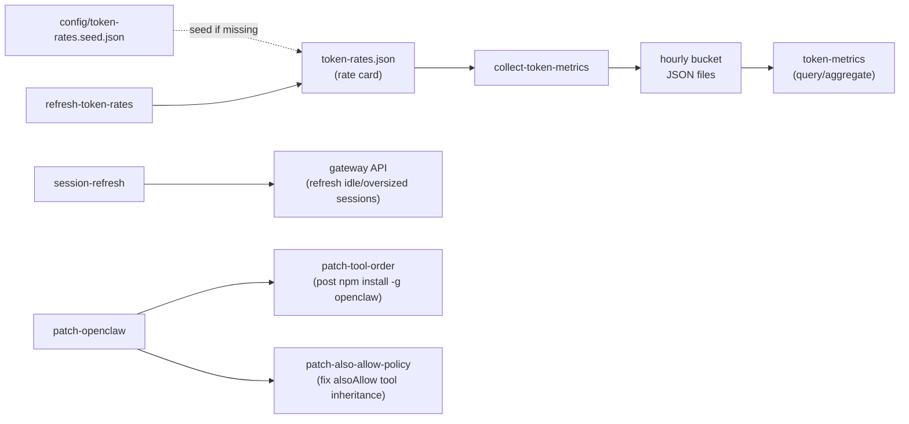

# admin/

Token metrics collection, session cost management, and OpenClaw post-install patches.

## Scripts

| Script | Description |
| --- | --- |
| `collect-token-metrics.ts` | Reads OpenClaw usage up to the last closed hour (from the agent SQLite DB on OpenClaw 2026.9+, else the legacy session transcripts), then Claude Code session logs, and writes immutable hourly rollup buckets to disk. Refuses to write when a model is missing from the rate card (records the id in `token-rates.pending.json` and triggers refresh-token-rates, which adds it from OpenRouter) |
| `session-refresh.ts` | Rotates bloated gateway sessions by resetting idle sessions with high cacheRead values |
| `token-metrics.ts` | Queries pre-rolled hourly buckets and aggregates into a cost report for a given time range (also a CLI: `tsx src/admin/token-metrics.ts [--from ISO] [--to ISO]`) |
| `refresh-token-rates.ts` | Seeds the rate card if missing, then refreshes every provider model's $/MTok rates from the public OpenRouter model endpoint (`openrouter.ai/api/v1/model/<id>`, base tier, no LLM). Also adds models the collector recorded as pending (`token-rates.pending.json`). Fetches 4 at a time (15 s per request, 60 s budget), writes changed rates atomically (advancing `updatedAt`), skips internal `openclaw/`/`clawdbot/` entries, and fails if any model can't be resolved (after applying the rest) or the card is missing or invalid. `--dry-run` reports changes without writing |
| `recalculate-token-metrics.ts` | Safe recalculation of token metrics for a date range with backup and dry-run support |
| `regenerate-token-metrics.ts` | Rebuilds hourly buckets for `[--from, --to)` from the agent DB plus Claude Code logs, and bootstraps the agent-DB cursor after the 2026.9 upgrade. Modes: `--out DIR` (scratch; refused when DIR is the live store, directly or through a symlink, or already holds buckets in range), live without `--to` (rebuild to the last closed hour, replaces cursors), live with `--to` (counted events only, cursors untouched); `--dry-run`. Live runs need the `OPENCLAW_UPGRADE_CUTOFF` environment variable (see [Regeneration settings](#regeneration-settings)) and refuse a `--from` before it without `--allow-pre-upgrade`; `--out` runs ignore it |
| `patch-openclaw.ts` | Orchestrator that runs every OpenClaw post-install patch (one failure never skips the rest), prints a per-patch summary, exits non-zero on any failure. Forwards `--dry-run` |
| `patch-tool-order.ts` | Patches OpenClaw's toolOrder array (located by content in any chunk) to insert Jeeves component tools above grep |
| `patch-also-allow-policy.ts` | Ensures `tools.alsoAllow` is not treated as a restrictive allowlist. No-op on OpenClaw ≥ 2026.9.x (fixed upstream); legacy patch for older builds |

All `patch-*.ts` scripts locate their target chunk by content across `.js` and `.mjs` files, are idempotent, refuse zero/multiple matches, write atomically, and accept `--dry-run` (print file, line, before/after; write nothing). Restart the gateway after a live run.

## Data Flow


```mermaid
flowchart LR
  collect["collect-token-metrics"] --> buckets["hourly bucket\nJSON files"]
  buckets --> metrics["token-metrics\n(query/aggregate)"]
  seed["config/token-rates.seed.json"] -. "seed if missing" .-> card["token-rates.json\n(rate card)"]
  rates["refresh-token-rates"] --> card
  card --> collect

  refresh["session-refresh"] --> gateway["gateway API\n(refresh idle/oversized sessions)"]

  patch["patch-openclaw"] --> order["patch-tool-order\n(post npm install -g openclaw)"]
  patch --> allow["patch-also-allow-policy\n(fix alsoAllow tool inheritance)"]
```

- **collect-token-metrics** incrementally reads OpenClaw usage (agent DB `~/.openclaw/agents/main/agent/openclaw-agent.sqlite`, read-only, on 2026.9+; legacy JSONL transcripts in `SESSIONS_DIR` otherwise) and Claude Code logs (`~/.claude/projects`), and rolls usage into per-hour bucket files partitioned by channel and model. A fresh instance (no counted OpenClaw usage) starts the DB cursor empty; an upgraded host refuses until `regenerate-token-metrics` bootstraps it.
- **token-metrics** reads those buckets and the rate card to produce aggregated cost reports.

### Storage

- Buckets: `TOKEN_METRICS_DIR` (`/opt/jeeves/state/jeeves-runner/token-metrics`, override with the `TOKEN_METRICS_DIR` environment variable), one file per UTC hour at `<yyyy>/<mm>/<hour>.json`.
- Rate card: `token-rates.json` in that directory ($/MTok per model per token category), seeded from `config/token-rates.seed.json` when missing (never overwritten). `refresh-token-rates` refreshes it from OpenRouter (base tier; prompt-length overrides and 1-hour cache writes ignored) and fails if a model can't be resolved or the card is missing or invalid. Token metrics are estimates; they are normalized against provider billing before invoicing.
- Cursors: runner state namespace `token-metrics`, keys `cursors` (legacy transcripts), `cursors-openclaw-db` (agent DB) and `cursors-claude-code`. A file cursor stops at the first record in the current (still-open) UTC hour, so the next run counts it once the hour closes; without one it stops at the end of the last complete line (an unterminated last line counts only once it parses). Each record is counted exactly once.

### Regeneration settings

`OPENCLAW_UPGRADE_CUTOFF` (environment variable, per instance, **no default**) is the first UTC hour this instance ran OpenClaw 2026.9+, in ISO 8601 (`YYYY-MM-DDTHH:00:00Z`); an instance that never ran an earlier OpenClaw uses its first hour of usage. Hours before it were counted by the legacy JSONL collector and are never rewritten. Only `regenerate-token-metrics` reads it, and only for live runs:

- unset, empty or not a date: a live run (including `--dry-run`) is refused with a message naming the variable, even with `--allow-pre-upgrade`;
- a live `--from` earlier than it is refused unless `--allow-pre-upgrade` is given (owner-approved only);
- `--out` scratch runs never touch the live store (an `--out` that resolves to `TOKEN_METRICS_DIR`, directly or through a symlink, is refused), so they ignore it: no variable or flag is needed to scan pre-upgrade hours into a scratch directory.

It is an environment variable (like `TOKEN_METRICS_DIR`) rather than a constant or a `pipeline-config.json` key because it is a one-off operator setting for a manually run CLI: a constant would need a per-instance template edit with a default, and `pipeline-config.json` requires the email configuration, which token metrics does not. `collect-token-metrics`, `token-metrics` and the other jobs never read it.

## Querying Costs

Run from the repo root:

```bash
tsx src/admin/token-metrics.ts --from 2026-06-01 --to 2026-06-02
```

`--from` / `--to` take ISO dates or timestamps. Without `--from` the report covers everything collected so far, and without `--to` it runs to now, so pass a range when the question is about a period. It prints a JSON `Costs` report (`types/token-metrics.ts`): total `cost`; `models`, keyed `provider/model`, each with `cost`, `costPct` and `tokens`, which holds per category (`input`, `output`, `cacheRead`, `cacheWrite`) `count` / `cost` / `costPct`; `channels` (Slack channels, DMs, heartbeat, subagent, meta-synthesis), each with its name, cost, share and per-model breakdown; and `ref`, the rate card the costs were computed with: per model, the rate for each category in dollars per million tokens, for every model in the card whether or not it was used in the range. `ref` holds prices, not usage; token counts are `models[model].tokens[category].count`. `getTokenMetrics({ fromTs, toTs })` is the importable form.

- **session-refresh** polls active sessions and refreshes any that exceed the cacheRead threshold after being idle long enough.

## Prerequisites

No external prerequisites — all jobs run against local filesystem and gateway API.

| Job                     | Schedule        |
| ----------------------- | --------------- |
| `collect-token-metrics` | Every 97 min    |
| `session-refresh`       | Every 23 min    |
| `refresh-token-rates`   | Daily 05:37 UTC |

All three entries in `jobs/admin.json` have `"prerequisite": null`. `refresh-token-rates` uses the RRStack schedule `{"freq":"daily","byhour":5,"byminute":37,"timezone":"UTC"}`.

## Documentation

- [Token Metrics Operational Runbook](../../docs/token-metrics-runbook.md) — pipeline stages, recalculation procedures, troubleshooting

## Key Files

| File | Purpose |
| --- | --- |
| `lib/bucket-io.ts` | Hourly bucket file I/O — read, write, merge, flush |
| `lib/channel-mapper.ts` | Maps session transcripts to channel keys (Slack, DM, heartbeat, subagent, meta-synthesis) from transcript text |
| `lib/channel-names.ts` | `ChannelResult`, Slack channel-name registry, Slack channel extraction, `slugify` |
| `lib/subagent-label.ts` | Meta-synthesis phase and granular subagent label detection |
| `lib/transcript-text.ts` | Extracts text chunks from session JSONL lines |
| `lib/openclaw-db/channel-from-meta.ts` | 2026.9+ channel keys from recorded session metadata; text rules only as fallback; sanitized |
| `lib/openclaw-db/schema-v23-meta.ts` | Loads schema-23 session keys and channel/peer/label names (read-only) |
| `lib/regen-guard.ts` | Live regenerate guard: refuses when `OPENCLAW_UPGRADE_CUTOFF` is unset or invalid, and a `--from` before it without `--allow-pre-upgrade` |
| `lib/regen-run.ts` | regenerate-token-metrics orchestration: scratch / live / bounded (`--to`, counted-only, cursors untouched), backup → delete → flush → cursor replace; refuses a scratch `--out` that is the live store |
| `lib/same-path.ts` | `isSamePath(a, b)`: same location after following symlinks (nearest existing ancestor for paths not created yet); keeps `--out` off the live store |
| `lib/collect-run.ts` | collect-token-metrics orchestration; loads the agent-DB collector (node:sqlite) lazily |
| `lib/fresh-openclaw-history.ts` | Fresh-instance check: with no DB cursor, the collector starts it empty only when no legacy cursor entry and no bucket holding OpenClaw usage exist; otherwise it refuses until regenerate bootstraps it |
| `lib/token-metrics-state.ts` | Runner-state port for the token-metrics namespace |
| `lib/bucket-maintenance.ts` | Bucket backup (`.backup-<ts>.json`, never overwritten) and deletion for rebuilds |
| `lib/claude-code-session-scan.ts` | Claude Code usage scan with byte cursors (stop at the open hour); `countedOnly` for bounded rebuilds |
| `lib/dm-names.ts` / `lib/dm-name-sources.ts` | Name `slack:dm:<USERID>` channels via cache → Slack user map → gateway `member-info` |
| `lib/openclaw-db/schema-v23-payloads.ts` | Schema-23 payload decoding and integrity checks (hot rows, cold and deleted/reset archives) |
| `lib/claude-code-scanner.ts` | Scans Claude Code session JSONL files for Anthropic usage records |
| `lib/also-allow-policy.ts` | Pure detection (upstream-fixed / legacy) and legacy patch for `hasRestrictiveAllowPolicy` |
| `lib/dist-patch-io.ts` | Finds dist chunks by content (.js/.mjs), previews or atomically applies a patch plan, `--dry-run` flag |
| `lib/openclaw-dist-fixtures.ts` | Verbatim OpenClaw v2026.9.6 dist snippets used as patch test fixtures |
| `lib/patch-runner.ts` | Runs patch scripts independently and formats the per-patch summary |
| `lib/patch-tool-order-utils.ts` | Pure helpers for toolOrder parsing/formatting and the per-chunk toolOrder patch evaluation |
| `lib/text-patch.ts` | Pure anchored/idempotent text-patch primitives and cross-file plan reduction |
| `lib/rate-card.ts` | Token rate card loader and cost calculator ($/MTok) |
| `lib/rate-card-schema.ts` | Zod schema and validating file reader for the rate card |
| `lib/rate-card-seed.ts` | Seed-if-missing: copies `config/token-rates.seed.json` into place, never overwrites |
| `lib/refresh-rates-run.ts` | refresh-token-rates orchestration: read card, fetch rates, apply changes, write, re-validate; decides job success |
| `lib/openrouter-pricing.ts` | OpenRouter single-model price fetch and per-token → $/MTok conversion |
| `lib/rate-card-pending.ts` | Pending-models file (`token-rates.pending.json`): ids the collector found missing from the card, handed to refresh-token-rates to add |
| `lib/recalc-utils.ts` | Pure helpers for recalculation: hour enumeration and cursor reset logic |
| `lib/resolve-openclaw-dist.ts` | Resolves global npm openclaw dist directory for patching |
| `lib/session-scanner.ts` | Session file scanning with cursor management (stop at the open hour) and range filtering (shared by collector and recalculator) |
| `lib/usage-parser.ts` | OpenClaw transcript line parser and usage normalizer (shared by collector and recalculator) |
| `types/token-metrics.ts` | Shared types across collector and query layers |
