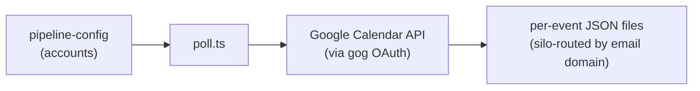

# calendar/

Polls Google Calendar events for configured accounts and writes individual JSON files with SHA-256 hash-based change detection.

## Scripts

| Script | Description |
| --- | --- |
| `poll.ts` | Iterates accounts from pipeline-config, fetches events via Calendar API, writes JSON files to silo-routed directories with change detection |

## Data Flow

- Polls a 90-day lookback + 90-day forward window per account.
- Uses SHA-256 hashing of significant event fields to detect changes; skips unchanged events.
- Writes events under `{silo}/calendar/{calendarId}/` with sanitized filenames.
- Tracks last-poll timestamps via runner state (`STATE_NAMESPACE = 'calendar'`).

## Prerequisites

- Google Calendar OAuth configured via `gog` CLI
- Calendar accounts listed in `pipeline-config.json` (see [Configuration Files](../lib/README.md#configuration-files) for schema and creation instructions)
- `GOG_CLIENT_PATH` and `GOG_CONFIG_DIR` set in `constants.ts`

| Job             | Schedule     |
| --------------- | ------------ |
| `calendar-poll` | Every 17 min |

## Key Files

| File | Purpose |
| --- | --- |
| `lib/calendar-api.ts` | Google Calendar REST API helpers — `listCalendars()` and `getAllEvents()` with pagination |
| `../lib/pipeline-config.ts` | Provides `getCalendarAccounts()` |
| `../lib/silo-router.ts` | Provides `getBasePathForEmailDomain()` for output routing |
