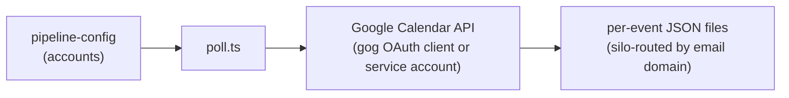

# calendar/

Polls Google Calendar events for configured accounts and writes individual JSON files with SHA-256 hash-based change detection.

## Scripts

| Script | Description |
| --- | --- |
| `poll.ts` | Iterates accounts from pipeline-config, fetches events via Calendar API, writes JSON files to silo-routed directories with change detection |

## Data Flow

```mermaid
flowchart LR
  config["pipeline-config\n(accounts)"] --> poll["poll.ts"]
  poll --> gcal["Google Calendar API\n(gog OAuth client or service account)"]
  gcal --> events["per-event JSON files\n(silo-routed by email domain)"]
```

- Polls a 90-day lookback + 90-day forward window per account.
- Uses SHA-256 hashing of significant event fields to detect changes; skips unchanged events.
- Writes events under `{silo}/calendar/{calendarId}/` with sanitized filenames.
- Tracks last-poll timestamps via runner state (`STATE_NAMESPACE = 'calendar'`).

## Prerequisites

- Google credentials via `gog`, under `GOG_CONFIG_DIR` (`GOG_HOME`, default `/opt/jeeves/config/gogcli`):
  - `calendar: { "tokenFile": ... }` accounts: OAuth client at `GOG_CLIENT_PATH` (`<GOG_CONFIG_DIR>/credentials.json`);
  - `calendar: { "serviceAccount": "auto" }` accounts: the service-account mailbox gog registers at `<GOG_CONFIG_DIR>/data/sa-<base64(email)>.json` (padding stripped; checked first, then the `<GOG_CONFIG_DIR>` root for older gog builds without `data/`), resolved by `src/lib/gog-credentials.ts`.
- Calendar accounts listed in `pipeline-config.json` (see [Configuration Files](../lib/README.md#configuration-files) for schema and creation instructions)
- Each account must have its own credential (checked by `lib/calendar-accounts.ts` before polling): a `tokenFile` account needs the OAuth client, and a `serviceAccount: "auto"` account needs that mailbox's own `sa-*.json`; an unrelated credential does not count. Accounts missing theirs are logged as `[credentials]` errors, the other accounts are still polled, and then the run fails (non-zero exit). With no calendar accounts configured the run skips (exit 0).

| Job             | Schedule     |
| --------------- | ------------ |
| `calendar-poll` | Every 17 min |

## Key Files

| File | Purpose |
| --- | --- |
| `lib/calendar-api.ts` | Google Calendar REST API helpers — `listCalendars()` and `getAllEvents()` with pagination |
| `lib/calendar-accounts.ts` | `resolveCalendarAccounts()`: maps each configured account to its auth config and reports accounts missing their own credential |
| `../lib/gog-credentials.ts` | `detectGogCredentials()` (OAuth client present?) and `findServiceAccountFile()` |
| `../lib/pipeline-config.ts` | Provides `getCalendarAccounts()` |
| `../lib/silo-router.ts` | Provides `getBasePathForEmailDomain()` for output routing |
