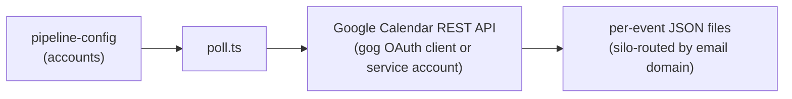

# calendar/

Polls Google Calendar events for configured accounts and writes individual JSON files with SHA-256 hash-based change detection.

## Scripts

| Script | Description |
| --- | --- |
| `poll.ts` | Iterates accounts from pipeline-config, fetches events via the Calendar API, writes JSON files to silo-routed directories with change detection |

## Data Flow

```mermaid
flowchart LR
  config["pipeline-config\n(accounts)"] --> poll["poll.ts"]
  poll --> gcal["Google Calendar REST API\n(gog OAuth client or service account)"]
  gcal --> events["per-event JSON files\n(silo-routed by email domain)"]
```

- Calls the Google Calendar REST API directly (`lib/calendar-api.ts`) with an access token from core's `createGoogleAuth`, read-only scope (`calendar.readonly`). It does not shell out to the `gog` binary; it only reads the credential files gog manages.
- Lists every calendar the account can see, following every page of the calendar list (calendars where it is only a `freeBusyReader` are skipped), and fetches all events in the window, also following every page. Both lists share one pager (`listAllPages()` in `lib/calendar-api.ts`).
- Window per account: from `lastSync - 24 h` (first run: 90 days back) to 90 days forward.
- Change detection: a SHA-256 (first 16 hex chars, stored as `_hash`) of the significant fields (summary, description, start, end, location, status, attendee emails and responses, recurrence, updated). An event whose hash is unchanged is not rewritten.
- Output: `{silo}/calendar/{accountEmail}/{calendar name}/{eventId}.json`, where `{silo}` is `getBasePathForEmailDomain(<account's domain>)` and `{calendar name}` is the calendar's summary (or id), sanitized. Each file is the API event plus `_calendarId`, `_calendarSummary`, `_ingestedAt` and `_hash`.
- State: runner state namespace `calendar`, key `lastSync-<email>` (ISO timestamp), written after the account's calendars are polled.
- An error fetching one calendar is logged and the others are still polled; an error for a whole account is logged and the next account is polled. Neither fails the run (missing credentials do, see below).

## Account Configuration

Calendar accounts are the entries in the `accounts` array of `pipeline-config.json` that have a `calendar` block (see [Configuration Files](../lib/README.md#configuration-files) for the full schema):

- `"calendar": { "serviceAccount": "auto" }`: a Workspace mailbox through domain-wide delegation. The poller uses the service-account registration gog keeps for that mailbox, `sa-<base64(email), "=" padding stripped>.json`, looked up in `<GOG_CONFIG_DIR>/data/` first, then in the `<GOG_CONFIG_DIR>` root (older gog builds without `data/`). Resolved by `findServiceAccountFile()` in `src/lib/gog-credentials.ts`.
- `"calendar": { "tokenFile": "<path>" }`: a personal account with an OAuth refresh token. `tokenFile` is relative to `CREDENTIALS_DIR`, and the account also needs the gog OAuth client at `GOG_CLIENT_PATH` (`<GOG_CONFIG_DIR>/credentials.json`).

`GOG_CONFIG_DIR` is gog's home: `GOG_HOME` when set, else `/opt/jeeves/config/gogcli` (`src/lib/constants/integrations.ts`). The key file jeeves-tools deploy writes (`<GOG_CONFIG_DIR>/service-account.json`) is **not** read by the poller; only the per-mailbox `sa-*.json` that `gog auth service-account set` registers is.

## Prerequisites

- Calendar accounts listed in `pipeline-config.json` (above).
- Each account must have its own credential (checked by `lib/calendar-accounts.ts` before polling): a `tokenFile` account needs the OAuth client, and a `serviceAccount: "auto"` account needs that mailbox's own `sa-*.json`; an unrelated credential does not count. An instance with only service-account mailboxes and no OAuth client works for its `serviceAccount` accounts.
- Accounts missing their credential are logged as `[credentials]` errors, the other accounts are still polled, and then the run fails (non-zero exit). So a run with calendar accounts configured but neither an OAuth client nor any matching service-account registration fails rather than skipping. With no calendar accounts configured the run skips (exit 0).

| Job             | Schedule     | Manifest             |
| --------------- | ------------ | -------------------- |
| `calendar-poll` | Every 17 min | `jobs/calendar.json` |

The manifest entry carries a non-null `prerequisite`.

## Key Files

| File | Purpose |
| --- | --- |
| `lib/calendar-api.ts` | Google Calendar REST API helpers — `listCalendars()` and `getAllEvents()`, each following every page (`nextPageToken`) |
| `lib/calendar-accounts.ts` | `resolveCalendarAccounts()`: maps each configured account to its auth config and reports accounts missing their own credential |
| `../lib/gog-credentials.ts` | `detectGogCredentials()` (OAuth client present?) and `findServiceAccountFile()` |
| `../lib/pipeline-config.ts` | Provides `getCalendarAccounts()` |
| `../lib/silo-router.ts` | Provides `getBasePathForEmailDomain()` for output routing |
