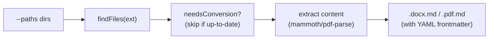

# convert/

CLI tools for converting DOCX and PDF files to Markdown with YAML frontmatter.

## Scripts

| Script | Description |
| --- | --- |
| `docx-to-md.ts` | Converts `.docx` files to Markdown via mammoth HTML extraction. CLI: `tsx src/convert/docx-to-md.ts --paths=dir1,dir2` |
| `pdf-to-md.ts` | Converts `.pdf` files to Markdown via pdf-parse text extraction. CLI: `tsx src/convert/pdf-to-md.ts --paths=dir1,dir2` |

## Data Flow

- Both scripts accept `--paths` with comma-separated directories to scan recursively.
- Output files are written alongside the source (e.g., `report.docx` → `report.docx.md`).
- Staleness checking: skips files whose `.md` output is newer than the source.
- No runner job manifests — these are invoked on-demand via CLI.

## Prerequisites

No external prerequisites. Uses bundled npm dependencies (`mammoth`, `pdf-parse`).

## Key Files

| File | Purpose |
| --- | --- |
| `lib/convert-utils.ts` | Shared utilities — `findFiles()`, `needsConversion()`, `writeMdFile()` |
