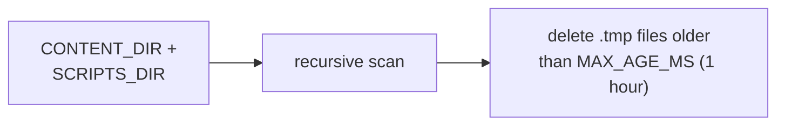

# core/

Housekeeping scripts for filesystem maintenance.

## Scripts

| Script | Description |
| --- | --- |
| `sweep-orphaned-tmp.ts` | Removes orphaned `.tmp` files left behind by crashed atomic-write operations. Scans `CONTENT_DIR` and `SCRIPTS_DIR` for `.tmp` files older than 1 hour. |

## Data Flow

- Skips `node_modules/` and `.git/` directories.
- Silently skips non-existent directories.
- Reports the count of removed files.

## Prerequisites

No external prerequisites. Requires `CONTENT_DIR` and `SCRIPTS_DIR` in `constants.ts`.

| Job                  | Schedule     |
| -------------------- | ------------ |
| `sweep-orphaned-tmp` | Every 59 min |
