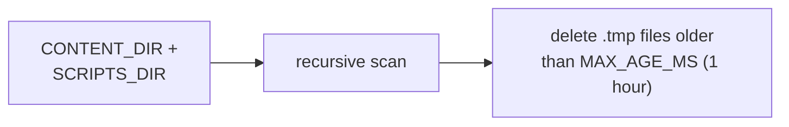

# core/

Housekeeping scripts for filesystem and service maintenance.

## Scripts

| Script | Description |
| --- | --- |
| `sweep-orphaned-tmp.ts` | Removes orphaned `.tmp` files left behind by crashed atomic-write operations. Scans `CONTENT_DIR` and `SCRIPTS_DIR` for `.tmp` files older than 1 hour. |
| `qdrant-health-check.ts` | Checks Qdrant liveness (`/healthz`, plain-text body, judged by HTTP status) and each collection's status and optimizer state. Attempts a non-interactive restart when Qdrant is down or unhealthy. |

## Data Flow

```mermaid
flowchart LR
  dirs["CONTENT_DIR +\nSCRIPTS_DIR"] --> scan["recursive scan"]
  scan --> delete["delete .tmp files older\nthan MAX_AGE_MS (1 hour)"]
```

- Skips `node_modules/` and `.git/` directories.
- Silently skips non-existent directories.
- Reports the count of removed files.

## Prerequisites

No external prerequisites. Requires `CONTENT_DIR` and `SCRIPTS_DIR` in `constants.ts`.

| Job                   | Schedule     |
| --------------------- | ------------ |
| `sweep-orphaned-tmp`  | Every 59 min |
| `qdrant-health-check` | Every 4 h    |

## Qdrant restart privileges

`qdrant-health-check` runs as the unprivileged runner user. On Linux it restarts with `systemctl --no-ask-password restart qdrant`, so it never waits on a polkit prompt. No sudoers or polkit rule for the Qdrant unit is assumed (the jeeves-tools polkit rule covers only `jeeves-*.service`). When the restart is denied, the job logs `qdrant down; restart requires operator` (or `qdrant unhealthy; …`) and exits non-zero, so the runner records an error for an operator to act on. Any other restart failure also exits non-zero.
