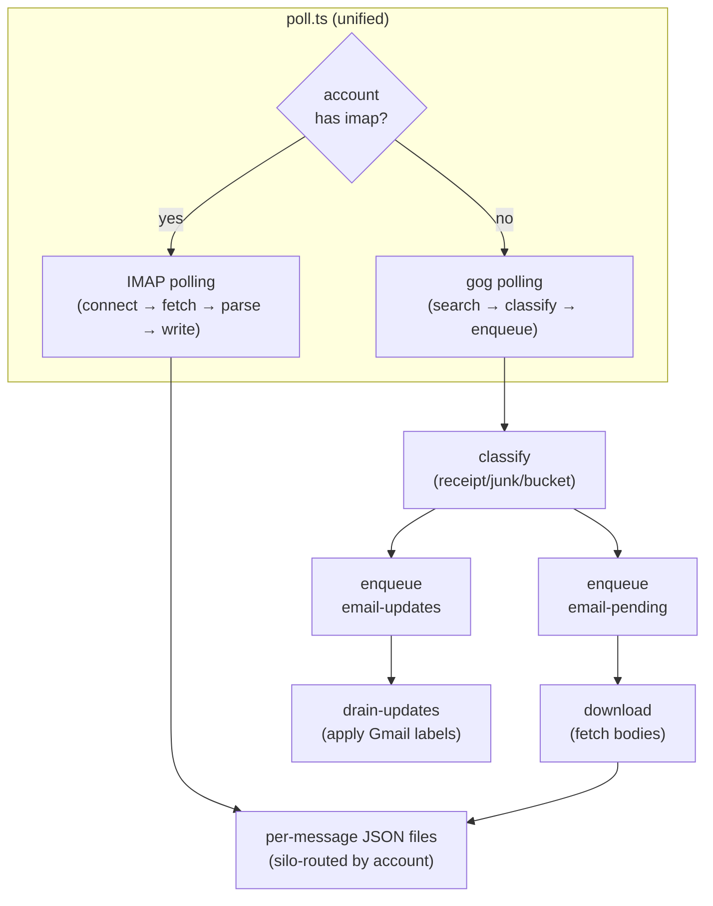

# email/

Unified email pipeline. Dispatches by account type: accounts with an `imap` block are polled via direct IMAP connection; accounts without are polled via the `gog` CLI (Gmail OAuth).

## Directory Structure

```
email/
  poll.ts                  ← unified entry point (dispatches by account type)
  email-cache.ts           ← shared: per-thread JSON cache
  email-state.ts           ← shared: per-thread/account state in runner SQLite
  imap/                    ← platform-agnostic IMAP transport
  google-workspace/        ← gog CLI transport (Gmail OAuth)
```

## Data Flow



## Runner Jobs

| Job                   | Script                              | Schedule     |
| --------------------- | ----------------------------------- | ------------ |
| `poll-email`          | `poll.ts`                           | Every 11 min |
| `download-email`      | `google-workspace/download.ts`      | Every 17 min |
| `drain-email-updates` | `google-workspace/drain-updates.ts` | Every 5 min  |

## Shared Modules

| File | Purpose |
| --- | --- |
| `poll.ts` | Unified entry point — IMAP accounts polled directly, gog accounts searched/classified/enqueued |
| `email-cache.ts` | Per-thread JSON cache — load, save, create/update, detect label changes |
| `email-state.ts` | Per-thread and per-account state in runner SQLite store |

## Prerequisites

- **gog accounts**: Gmail OAuth configured via `gog` CLI, `GOG_CLIENT_PATH` set in `constants.ts`
- **IMAP accounts**: `imap` connection block in pipeline config with host/port/user/password
- All accounts: listed in `pipeline-config.json` with `emailPolling: true` and a `type` field (`gmail` or `imap`)

---

## imap/

Platform-agnostic IMAP email polling. Connects to any IMAP provider, fetches new messages via UID watermark, parses MIME, and writes thread/message JSON files identical to the gog pipeline output.

Called by `poll.ts` for accounts with an `imap` block in pipeline config.

### Modules

| Module | Purpose |
| --- | --- |
| `account-types.ts` | Account type registry — maps type names (`gmail`, `imap`) to provider-specific behavior: IMAP extensions, key resolvers, label normalization, folder enumeration |
| `normalize.ts` | `NormalizedMessage` interface + normalizer that maps `imapflow` fetch results + `mailparser` output into a stable abstraction |
| `key-resolver.ts` | JSONPath evaluation against `NormalizedMessage`, auto-transform (decimal → hex, else → SHA-256 truncated to 16 hex chars) |
| `poll.ts` | `pollImapAccount()` — connects, fetches by UID watermark, normalizes, resolves keys, deduplicates, writes to disk, updates watermark |

### Account Type Registry

| Type | Extensions | Thread Key Source | Label Source |
| --- | --- | --- | --- |
| `gmail` | `X-GM-THRID`, `X-GM-MSGID`, `X-GM-LABELS` | Gmail thread ID (decimal → hex) | Gmail labels (normalized to API format) |
| `imap` | _(none)_ | `References` header thread root (SHA-256) | IMAP flags (normalized to standard vocabulary) |

### Key Resolution

Each account type defines `threadId` and `messageId` as `string[]` — JSONPath expressions evaluated against `NormalizedMessage`. All paths must resolve; values are concatenated; transform is automatic:

- Decimal integer string → lowercase hex (BigInt conversion)
- Anything else → SHA-256 truncated to 16 hex chars

### Watermark

Incremental polling via IMAP UIDs stored in runner state namespace `imap-poll`. Per-account, per-folder `{ uidValidity, lastUid }`. First run caps at last 100 messages to avoid loading entire mailboxes.

---

## google-workspace/

Gmail polling via the `gog` CLI (Google OAuth). Handles search, classification, body download, and label management.

### Scripts

| Script | Description |
| --- | --- |
| `download.ts` | Dequeues threads from `email-pending` and downloads full message bodies, headers, and attachments |
| `drain-updates.ts` | Dequeues label-change actions from `email-updates` and applies them to Gmail via `gog gmail thread modify` |
| `email-fetch.ts` | Fetch full thread metadata from Gmail, update cache/provenance, enqueue for download |
| `email-triage.ts` | Pure-function classification helpers (receipt, junk, bucket, importance) |
| `backfill-bodies.ts` | One-shot: finds cached threads missing downloaded message bodies and enqueues them |
| `backfill-classification.ts` | One-shot: classifies threads missing receipt/junk/bucket fields and enqueues label actions |
| `backfill-historical.ts` | One-shot: searches Gmail for threads in a date range predating the pipeline and processes them |
| `backfill-labels.ts` | One-shot: enqueues label actions for threads with classification but no applied labels |
| `inventory.ts` | Prints a summary table of thread directories, message files, and state counts per account |

### Classification

- **Receipt candidate**: matches financial receipt/invoice keywords in subject/snippet/from
- **Junk candidate**: matches newsletter/promo/marketing keywords
- **Bucket**: domain-based classification via pipeline-config (e.g., VC, Sales, Personal)
- Labels are computed by `computeLabelsToApply()` and applied idempotently

## Output Format

Both transports produce identical on-disk output — `thread.json` (ThreadCache) + `{messageId}.json` per thread directory at `{siloBase}/email/threads/{account}/{threadId}/`.
