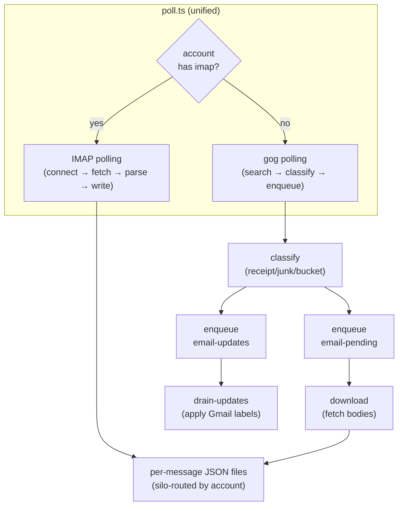

# email/

Unified email pipeline. Dispatches by account type: accounts with an `imap` block are polled via direct IMAP connection; accounts without are polled via the `gog` CLI (Gmail, via an OAuth client or service-account mailboxes).

## Directory Structure

```
email/
  poll.ts                  ← unified entry point (dispatches by account type)
  email-cache.ts           ← shared: per-thread JSON cache
  email-state.ts           ← shared: per-thread/account state in runner SQLite
  imap/                    ← platform-agnostic IMAP transport
  google-workspace/        ← gog CLI transport (Gmail)
```

## Data Flow


```mermaid
flowchart TD
  subgraph "poll.ts (unified)"
    dispatch{"account\nhas imap?"}
    dispatch -->|yes| imap["IMAP polling\n(connect → fetch → parse → write)"]
    dispatch -->|no| gog["gog polling\n(search → classify → enqueue)"]
  end
  imap --> files["per-message JSON files\n(silo-routed by account)"]
  gog --> classify["classify\n(receipt/junk/bucket)"]
  classify --> pending["enqueue\nemail-pending"]
  classify --> updates["enqueue\nemail-updates"]
  pending --> download["download\n(fetch bodies)"]
  updates --> drain["drain-updates\n(apply Gmail labels)"]
  download --> files
```

## Transports

`poll.ts` takes every account with `emailPolling: true` and routes it by the presence of an `imap` block (not by `type`):

| Transport | Selected when | Steps | Code |
| --- | --- | --- | --- |
| gog (Gmail API) | no `imap` block | Poll (search) → Classify → Enqueue → Download → Drain (apply labels) | `google-workspace/`, via `../lib/gog.ts` (retry wrapper around the `gog` binary) |
| IMAP | `imap` block present | Connect → Fetch (UID watermark) → Parse MIME → Write, in one step | `imap/` (`imapflow` + `mailparser`; no external binary) |

- **gog poll:** each run searches `in:anywhere` (so spam and trash are included and human actions there are visible) and takes the newest 100 threads per account. Every thread is classified and its thread state updated; a thread that is new or updated (more messages or a newer date) **and** looks important (labelled `INBOX` or `UNREAD`, a receipt candidate, or in a bucket listed in `buckets.priority`) is deep-fetched (`email-fetch.ts`): full metadata into the thread cache, label-change provenance, curation signals, and new messages enqueued on `email-pending` for `download`.
- **IMAP poll:** per folder, fetches messages above the stored UID, parses them and writes the files directly (see [imap/](#imap)). An error on one IMAP account is logged and the other accounts are still polled.
- Both transports write the same layout (see [Output Format](#output-format)).

## Runner Jobs

| Job | Script | Schedule |
| --- | --- | --- |
| `email-poll` | `poll.ts` | Every 11 min |
| `email-download` | `google-workspace/download.ts` | Every 13 min |
| `email-drain-updates` | `google-workspace/drain-updates.ts` | Every 17 min |
| `email-backfill-historical` | `google-workspace/backfill-historical.ts --live` | Hourly; needs `emailConfig.backfill` |

The manifest (`jobs/email.json`) is authoritative. All four entries carry a non-null `prerequisite` (gog credentials or IMAP, plus `emailConfig.backfill` for the backfill).

### Historical backfill

`email-backfill-historical` runs `backfill-historical.ts --live` (the manifest passes `--live` in `args`; a manual run without it is a dry run). Each run searches one window per account (all result pages), walking back from the newest unprocessed point until the lookback limit, then does nothing.

- Settings come only from `emailConfig.backfill` in pipeline-config (`accounts`, `lookbackDays`, `windowDays`, all required) or the CLI overrides `--accounts` / `--lookback-days` / `--window-days` (per field, CLI wins). There are no defaults: a missing setting fails the run.
- Cursor: runner state namespace `email-backfill`, key `cursor-<email>`. It advances only after a live window completes (after the window's last search page).

## State, Queues and Logs

| Where | What |
| --- | --- |
| Runner state `email`, key `<account>.state` | Per-account scalar state (`email-state.ts`) |
| Runner state items `email` / `<account>.seenThreadIds`, item key `<threadId>` | Per-thread state: classification, labels applied, seen messages |
| Runner state `imap-poll` | IMAP watermark per account and folder: `{ uidValidity, lastUid }` |
| Runner state `email-backfill`, key `cursor-<email>` | Historical backfill cursor |
| Queue `email-pending` | Threads whose bodies `download` fetches |
| Queue `email-updates` | Label actions `drain-updates` applies to Gmail |
| `EMAIL_EVENTS_DIR` (`/opt/jeeves/state/runner/email-events`) | Event logs: `<account>.jsonl` (thread seen/updated) and `_runs-*.jsonl` (per-run summaries); `trim-jsonl.ts` drops event lines older than 7 days after each poll |

## Shared Modules

| File | Purpose |
| --- | --- |
| `poll.ts` | Unified entry point — IMAP accounts polled directly, gog accounts searched/classified/enqueued |
| `email-cache.ts` | Per-thread JSON cache — load, save, create/update, detect label changes |
| `email-state.ts` | Per-thread and per-account state in runner SQLite store; `EmailStoreClient` is the narrow runner-client type the pipeline uses |
| `trim-jsonl.ts` | `trimJsonlFiles()`: drops event-log lines older than 7 days after each poll (`_runs-*.jsonl` kept) |

## Prerequisites

- **gog accounts**: gog credentials under `GOG_CONFIG_DIR` (`GOG_HOME`, default `/opt/jeeves/config/gogcli`), either or both of:
  - an OAuth client at `GOG_CLIENT_PATH` (`<GOG_CONFIG_DIR>/credentials.json`) plus per-account tokens; or
  - service-account mailboxes (domain-wide delegation) registered by gog at `<GOG_CONFIG_DIR>/data/sa-<base64(email)>.json` (padding stripped; checked first, then the `<GOG_CONFIG_DIR>` root for older gog builds without `data/`). jeeves-tools deploy writes the key to `<GOG_CONFIG_DIR>/service-account.json`.

  Detection lives in one place, `src/lib/gog-credentials.ts`. If gog accounts are configured but neither credential type exists, `poll`, `download`, `drain-updates` and `backfill-historical` **fail** (non-zero exit, clear message) instead of skipping; `drain-updates` fails even when `reportOnly` is set. With no gog accounts configured they skip quietly. For `download` and `drain-updates`, "gog accounts" means `getGmailAccounts()`: polled accounts without an `imap` block plus `emailConfig.backfill.accounts`, so items queued by a backfill-only account are still consumed.

- **`emailConfig.reportOnly: true`**: mail is still ingested and archived, but nothing is written back to Gmail. Every `email-updates` write goes through `google-workspace/label-actions.ts`, so `poll`, `backfill-historical` and the one-shot `backfill-classification.ts` / `backfill-labels.ts` enqueue neither classification labels nor curation-signal actions (`watch` added/removed by `email-fetch.ts`), `meetings/extract.ts` enqueues no `meeting` label or archive (`meetings/lib/email-actions.ts`), and `drain-updates` dequeues and applies nothing (any items already queued are left pending until `reportOnly` is turned off). Actions skipped in `reportOnly` are dropped, not deferred: turning it off does not replay them. Classification labels can be caught up afterwards with `backfill-labels.ts --live`, because `labelApplied` records only labels actually enqueued. Curation-signal actions are not replayed. The `meeting` label and archive of a meeting packaged while `reportOnly` was on are the exception: `meetings/extract.ts` records them as pending and catches them up once `reportOnly` is off (see [meetings/](../meetings/README.md#reportonly-catch-up)).
- **IMAP accounts**: `imap` connection block in pipeline config with host/port/user/password, the password normally a `secretRef` to a file in `IMAP_SECRETS_DIR` (see [IMAP passwords](#imap-passwords)).
- All accounts: listed in `pipeline-config.json` with `emailPolling: true` and a `type` field (`gmail` or `imap`).

## Account Configuration

Accounts are entries in the `accounts` array of `pipeline-config.json` (schema: `src/lib/pipeline-config.ts`; full example in [Configuration Files](../lib/README.md#configuration-files)):

```json
{
  "email": "user@example.com",
  "type": "imap",
  "emailPolling": true,
  "imap": {
    "host": "imap.example.com",
    "port": 993,
    "tls": true,
    "user": "user@example.com",
    "password": { "secretRef": "user-example-com" }
  },
  "folders": ["INBOX", "Sent"]
}
```

- `type` is `gmail` or `imap`; `type: "imap"` requires the `imap` block (schema error otherwise). A `gmail` account **with** an `imap` block is polled over IMAP using the Gmail extensions (thread ids, labels); a `gmail` account without one goes through gog.
- `folders` is optional (IMAP only). Without it, `gmail` accounts poll `[Gmail]/All Mail`, `[Gmail]/Spam` and `[Gmail]/Trash`; generic IMAP accounts poll every folder the server lists.
- `imap.password` is a secret reference (below). `pipeline-config.json` is gitignored and holds no secrets.

### IMAP passwords

`imap.password` takes one of two forms (schema: `src/lib/pipeline-config.ts`; resolver: `src/lib/imap-secrets.ts`):

- **`{ "secretRef": "<name>" }`** (preferred). The password lives in the file `IMAP_SECRETS_DIR/<name>`, i.e. `<CREDENTIALS_DIR>/imap/<name>` (`/opt/jeeves/config/credentials/imap/<name>` on a standard instance). `<name>` follows the jeeves-tools secret-name rule: 1-64 characters, letters, digits, `_` and `-`, starting with a letter or digit (no dots, no path separators); anything else fails config validation. The poller reads the file each time it connects, so a rotated password needs no restart; trailing newlines are removed. A missing, unreadable or empty file fails that account's poll with an error naming the ref and the path (never the value); the other accounts are still polled.
- **A literal string** (deprecated). Still accepted, but loading the config logs one warning per process: `pipeline-config: accounts[].imap.password as a plain string is deprecated; put the password in a file in <IMAP_SECRETS_DIR> and set imap.password to { "secretRef": "<file name>" }.`

Provisioning: on a jeeves-tools-managed instance, put each password in the instance config's `secrets` map under the same name as the `secretRef`; deploy writes it to `IMAP_SECRETS_DIR/<name>` (owner jeeves, mode 0600) and never logs it (see [jeeves-tools#178](https://github.com/karmaniverous/jeeves-tools/issues/178)). On a standalone instance, create the file yourself with the same owner and mode. The password is never logged, written to runner state or included in an error.

---

## imap/

Platform-agnostic IMAP email polling. Connects to any IMAP provider, fetches new messages via UID watermark, parses MIME, and writes thread/message JSON files identical to the gog pipeline output.

Called by `poll.ts` for accounts with an `imap` block in pipeline config.

### Modules

| Module | Purpose |
| --- | --- |
| `account-types.ts` | Account type registry — maps type names (`gmail`, `imap`) to provider-specific behavior: IMAP extensions, key resolvers, label normalization, folder enumeration |
| `normalize.ts` | `NormalizedMessage` interface + normalizer that maps `imapflow` fetch results + `mailparser` output into a stable abstraction |
| `key-resolver.ts` | JSONPath evaluation against `NormalizedMessage`, auto-transform (decimal → hex, else → SHA-256 truncated to 16 hex chars) |
| `poll.ts` | `pollImapAccount()` — connects, fetches by UID watermark, normalizes, resolves keys, deduplicates, writes to disk, updates watermark |

### Account Type Registry

| Type | Extensions | Thread Key Source | Label Source |
| --- | --- | --- | --- |
| `gmail` | `X-GM-THRID`, `X-GM-MSGID`, `X-GM-LABELS` | Gmail thread ID (decimal → hex) | Gmail labels (normalized to API format) |
| `imap` | _(none)_ | `References` header thread root (SHA-256) | IMAP flags (normalized to standard vocabulary) |

### Key Resolution

Each account type defines `threadId` and `messageId` as `string[]` — JSONPath expressions evaluated against `NormalizedMessage`. All paths must resolve; values are concatenated; transform is automatic:

- Decimal integer string → lowercase hex (BigInt conversion)
- Anything else → SHA-256 truncated to 16 hex chars

### Watermark

Incremental polling via IMAP UIDs stored in runner state namespace `imap-poll`. Per-account, per-folder `{ uidValidity, lastUid }`. First run caps at last 100 messages to avoid loading entire mailboxes.

---

## google-workspace/

Gmail polling via the `gog` CLI (OAuth client or service-account mailboxes). Handles search, classification, body download, and label management.

### Scripts

| Script | Description |
| --- | --- |
| `download.ts` | Dequeues threads from `email-pending` and downloads full message bodies, headers, and attachments |
| `drain-updates.ts` | Dequeues label-change actions from `email-updates` and applies them to Gmail via `gog gmail thread modify` |
| `email-fetch.ts` | Fetch full thread metadata from Gmail, update cache/provenance, enqueue for download; curation signals are enqueued via `label-actions.ts` (none in `reportOnly`) |
| `gmail-search.ts` | Zod-validated parsing of `gog gmail search --json` pages (`parseSearchPage`) and lazy paging over `nextPageToken` (`searchThreadPages`, throws on a repeated token). Used by `poll.ts` and `backfill-window.ts` |
| `message-record.ts` | Builds the per-message JSON record and `thread.json` summary that `download.ts` writes |
| `email-triage.ts` | Pure-function classification helpers (receipt, junk, bucket, importance); `classifyCandidates()` is the one receipt/junk rule every classifying path uses |
| `backfill-bodies.ts` | One-shot: finds cached threads missing downloaded message bodies and enqueues them. Dry-run unless `--live` |
| `backfill-classification.ts` | One-shot: classifies threads missing receipt/junk/bucket fields and enqueues label actions. Dry-run unless `--live`; `--reclassify-buckets` also recomputes the bucket of threads already classified |
| `backfill-historical.ts` | Paced job: each run searches one window per account (all result pages), walking back from the newest unprocessed point to the lookback limit, then no-ops. Settings from `emailConfig.backfill` (`accounts`, `lookbackDays`, `windowDays`) or `--accounts` / `--lookback-days` / `--window-days`; no defaults. Dry-run unless `--live`. Cursor: runner state `email-backfill` / `cursor-<email>`. Settings in `backfill-settings.ts`, window processing in `backfill-window.ts` |
| `backfill-settings.ts` | `resolveBackfillSettings()`: CLI args over `emailConfig.backfill`, per field; throws when any field is missing |
| `backfill-window.ts` | Cursor and window arithmetic and `backfillAccount()`: processes the window one search page at a time and advances the cursor (live only) after the last page |
| `label-actions.ts` | Every `email-updates` write, gated on `reportOnly` (`enqueueEmailUpdates`, `enqueueLabelActions`, `curationSignalActions`; meetings/extract.ts also enqueues through `enqueueEmailUpdates`); the drain-updates go/no-go (`planDrain`); action-to-label mapping for drain-updates (`labelChangesFor`, `threadModifyArgs`) |
| `backfill-labels.ts` | One-shot: enqueues label actions for threads with classification but no applied labels. Dry-run unless `--live` |
| `inventory.ts` | Prints a summary table of thread directories, message files, and state counts per account |

### Classification

- **Receipt candidate**: matches financial receipt/invoice keywords in subject/snippet/from
- **Junk candidate**: matches newsletter/promo/marketing keywords, and is never set on a receipt candidate. `poll`, `backfill-historical` and the one-shot `backfill-classification.ts` (including `--reclassify-buckets`, which keeps stored flags) all classify through `classifyCandidates()` in `email-triage.ts`, so the rule holds on every path.
- **Bucket**: domain-based classification via pipeline-config. Bucket names come only from `buckets` (`priority` order, then buckets that appear only in `domains`; see `getBucketNames()`), and each bucket name is also its Gmail label. Code hard-codes no bucket name.
- Labels (`receipt`, `junk`, the bucket name) are computed by `computeLabelsToApply()`, enqueued on `email-updates` only when the classification changes, and recorded per thread (`labelApplied`) so each is applied once.

### Curation signals and provenance

- When a thread is deep-fetched, every label difference from the cached copy is recorded in the thread cache's `provenance` (`+label` / `-label`, `by: "human"`, per message): added/removed labels, stars, moves to or from spam/trash. Treat these as classification feedback. Label changes on a thread that is not deep-fetched (no new message, not important) are picked up the next time it is.
- `watch` label (`curationSignalActions()` in `label-actions.ts`): added when a message the pipeline had already seen moves from the archive back to the inbox; removed when a watched message is no longer in the inbox. The only producer of `archive` actions is `meetings/extract.ts`, and it never archives a message that carries `watch` (`meetings/lib/email-actions.ts`). `drain-updates` itself applies queued actions as they are, without re-checking labels, so any new producer of `archive` must make the same check.

### Receipt forwarding settings

`emailConfig.receipt.forwardEnabled` (on/off) and `emailConfig.receipt.sparkReceiptsForwardTo` (destination) are validated by `pipeline-config.ts`, but no template script forwards receipts; instance scripts read them. The deprecated key `forwardJGS` is still read as an alias with a one-line warning (see [Configuration Files](../lib/README.md#configuration-files)).

## Output Format

Both transports produce identical on-disk output — `thread.json` (ThreadCache) + `{messageId}.json` per thread directory at `{siloBase}/email/threads/{account}/{threadId}/`.
