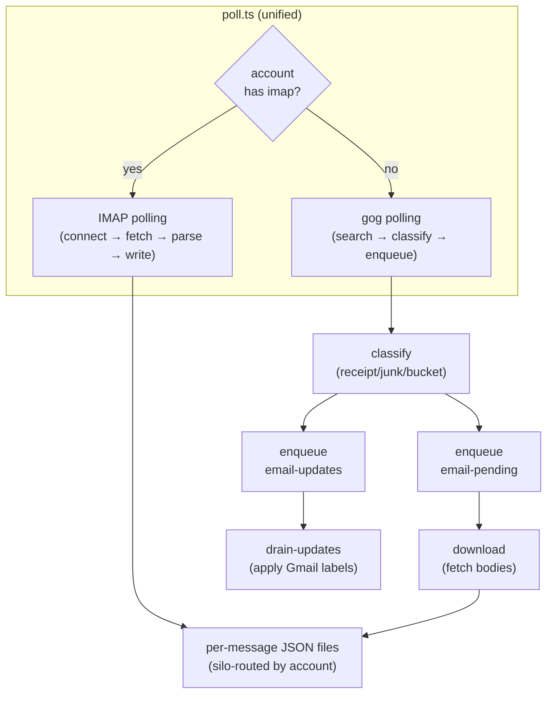

# email/

Unified email pipeline. Dispatches by account type: accounts with an `imap` block are polled via direct IMAP connection; accounts without are polled via the `gog` CLI (Gmail, via an OAuth client or service-account mailboxes).

## Directory Structure

```
email/
  poll.ts                  ← unified entry point (dispatches by account type)
  email-cache.ts           ← shared: per-thread JSON cache
  email-state.ts           ← shared: per-thread/account state in runner SQLite
  imap/                    ← platform-agnostic IMAP transport
  google-workspace/        ← gog CLI transport (Gmail)
```

## Data Flow


```mermaid
flowchart TD
  subgraph "poll.ts (unified)"
    dispatch{"account\nhas imap?"}
    dispatch -->|yes| imap["IMAP polling\n(connect → fetch → parse → write)"]
    dispatch -->|no| gog["gog polling\n(search → classify → enqueue)"]
  end
  imap --> files["per-message JSON files\n(silo-routed by account)"]
  gog --> classify["classify\n(receipt/junk/bucket)"]
  classify --> pending["enqueue\nemail-pending"]
  classify --> updates["enqueue\nemail-updates"]
  pending --> download["download\n(fetch bodies)"]
  updates --> drain["drain-updates\n(apply Gmail labels)"]
  download --> files
```

## Runner Jobs

| Job | Script | Schedule |
| --- | --- | --- |
| `email-poll` | `poll.ts` | Every 11 min |
| `email-download` | `google-workspace/download.ts` | Every 13 min |
| `email-drain-updates` | `google-workspace/drain-updates.ts` | Every 17 min |
| `email-backfill-historical` | `google-workspace/backfill-historical.ts --live` | Hourly; needs `emailConfig.backfill` (not auto-registered) |

## Shared Modules

| File | Purpose |
| --- | --- |
| `poll.ts` | Unified entry point — IMAP accounts polled directly, gog accounts searched/classified/enqueued |
| `email-cache.ts` | Per-thread JSON cache — load, save, create/update, detect label changes |
| `email-state.ts` | Per-thread and per-account state in runner SQLite store; `EmailStoreClient` is the narrow runner-client type the pipeline uses |
| `trim-jsonl.ts` | `trimJsonlFiles()`: drops event-log lines older than 7 days after each poll (`_runs-*.jsonl` kept) |

## Prerequisites

- **gog accounts**: gog credentials under `GOG_CONFIG_DIR` (`GOG_HOME`, default `/opt/jeeves/config/gogcli`), either or both of:
  - an OAuth client at `GOG_CLIENT_PATH` (`<GOG_CONFIG_DIR>/credentials.json`) plus per-account tokens; or
  - service-account mailboxes (domain-wide delegation) registered by gog at `<GOG_CONFIG_DIR>/data/sa-<base64(email)>.json` (padding stripped; checked first, then the `<GOG_CONFIG_DIR>` root for older gog builds without `data/`). jeeves-tools deploy writes the key to `<GOG_CONFIG_DIR>/service-account.json`.

  Detection lives in one place, `src/lib/gog-credentials.ts`. If gog accounts are configured but neither credential type exists, `poll`, `download`, `drain-updates` and `backfill-historical` **fail** (non-zero exit, clear message) instead of skipping; `drain-updates` fails even when `reportOnly` is set. With no gog accounts configured they skip quietly. For `download` and `drain-updates`, "gog accounts" means `getGmailAccounts()`: polled accounts without an `imap` block plus `emailConfig.backfill.accounts`, so items queued by a backfill-only account are still consumed.

- **`emailConfig.reportOnly: true`**: mail is still ingested and archived, but nothing is written back to Gmail. Every `email-updates` write goes through `google-workspace/label-actions.ts`, so `poll` and `backfill-historical` enqueue neither classification labels nor curation-signal actions (`watch` added/removed by `email-fetch.ts`), and `drain-updates` dequeues and applies nothing (any items already queued are left pending).
- **IMAP accounts**: `imap` connection block in pipeline config with host/port/user/password
- All accounts: listed in `pipeline-config.json` with `emailPolling: true` and a `type` field (`gmail` or `imap`)

---

## imap/

Platform-agnostic IMAP email polling. Connects to any IMAP provider, fetches new messages via UID watermark, parses MIME, and writes thread/message JSON files identical to the gog pipeline output.

Called by `poll.ts` for accounts with an `imap` block in pipeline config.

### Modules

| Module | Purpose |
| --- | --- |
| `account-types.ts` | Account type registry — maps type names (`gmail`, `imap`) to provider-specific behavior: IMAP extensions, key resolvers, label normalization, folder enumeration |
| `normalize.ts` | `NormalizedMessage` interface + normalizer that maps `imapflow` fetch results + `mailparser` output into a stable abstraction |
| `key-resolver.ts` | JSONPath evaluation against `NormalizedMessage`, auto-transform (decimal → hex, else → SHA-256 truncated to 16 hex chars) |
| `poll.ts` | `pollImapAccount()` — connects, fetches by UID watermark, normalizes, resolves keys, deduplicates, writes to disk, updates watermark |

### Account Type Registry

| Type | Extensions | Thread Key Source | Label Source |
| --- | --- | --- | --- |
| `gmail` | `X-GM-THRID`, `X-GM-MSGID`, `X-GM-LABELS` | Gmail thread ID (decimal → hex) | Gmail labels (normalized to API format) |
| `imap` | _(none)_ | `References` header thread root (SHA-256) | IMAP flags (normalized to standard vocabulary) |

### Key Resolution

Each account type defines `threadId` and `messageId` as `string[]` — JSONPath expressions evaluated against `NormalizedMessage`. All paths must resolve; values are concatenated; transform is automatic:

- Decimal integer string → lowercase hex (BigInt conversion)
- Anything else → SHA-256 truncated to 16 hex chars

### Watermark

Incremental polling via IMAP UIDs stored in runner state namespace `imap-poll`. Per-account, per-folder `{ uidValidity, lastUid }`. First run caps at last 100 messages to avoid loading entire mailboxes.

---

## google-workspace/

Gmail polling via the `gog` CLI (OAuth client or service-account mailboxes). Handles search, classification, body download, and label management.

### Scripts

| Script | Description |
| --- | --- |
| `download.ts` | Dequeues threads from `email-pending` and downloads full message bodies, headers, and attachments |
| `drain-updates.ts` | Dequeues label-change actions from `email-updates` and applies them to Gmail via `gog gmail thread modify` |
| `email-fetch.ts` | Fetch full thread metadata from Gmail, update cache/provenance, enqueue for download; curation signals are enqueued via `label-actions.ts` (none in `reportOnly`) |
| `gmail-search.ts` | Zod-validated parsing of `gog gmail search --json` pages (`parseSearchPage`) and lazy paging over `nextPageToken` (`searchThreadPages`, throws on a repeated token). Used by `poll.ts` and `backfill-window.ts` |
| `message-record.ts` | Builds the per-message JSON record and `thread.json` summary that `download.ts` writes |
| `email-triage.ts` | Pure-function classification helpers (receipt, junk, bucket, importance) |
| `backfill-bodies.ts` | One-shot: finds cached threads missing downloaded message bodies and enqueues them |
| `backfill-classification.ts` | One-shot: classifies threads missing receipt/junk/bucket fields and enqueues label actions |
| `backfill-historical.ts` | Paced job: each run searches one window per account (all result pages), walking back from the newest unprocessed point to the lookback limit, then no-ops. Settings from `emailConfig.backfill` (`accounts`, `lookbackDays`, `windowDays`) or `--accounts` / `--lookback-days` / `--window-days`; no defaults. Dry-run unless `--live`. Cursor: runner state `email-backfill` / `cursor-<email>`. Settings in `backfill-settings.ts`, window processing in `backfill-window.ts` |
| `backfill-settings.ts` | `resolveBackfillSettings()`: CLI args over `emailConfig.backfill`, per field; throws when any field is missing |
| `backfill-window.ts` | Cursor and window arithmetic and `backfillAccount()`: processes the window one search page at a time and advances the cursor (live only) after the last page |
| `label-actions.ts` | Every `email-updates` write, gated on `reportOnly` (`enqueueEmailUpdates`, `enqueueLabelActions`, `curationSignalActions`); the drain-updates go/no-go (`planDrain`); action-to-label mapping for drain-updates (`labelChangesFor`, `threadModifyArgs`) |
| `backfill-labels.ts` | One-shot: enqueues label actions for threads with classification but no applied labels |
| `inventory.ts` | Prints a summary table of thread directories, message files, and state counts per account |

### Classification

- **Receipt candidate**: matches financial receipt/invoice keywords in subject/snippet/from
- **Junk candidate**: matches newsletter/promo/marketing keywords
- **Bucket**: domain-based classification via pipeline-config (bucket names come from `buckets` in pipeline-config; each bucket name is also its Gmail label)
- Labels are computed by `computeLabelsToApply()` and applied idempotently

## Output Format

Both transports produce identical on-disk output — `thread.json` (ThreadCache) + `{messageId}.json` per thread directory at `{siloBase}/email/threads/{account}/{threadId}/`.
