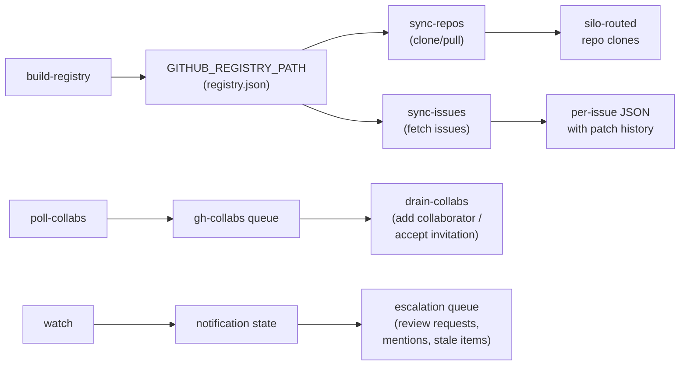

# github/

GitHub repo sync, issue sync, notification monitoring, and collaborator management.

## Scripts

| Script | Description |
| --- | --- |
| `build-registry.ts` | Enumerates all accessible GitHub repos (with push access) and external org repos, builds a JSON registry with metadata and social policy classification |
| `sync-repos.ts` | Shallow-clones or pulls tracked repos in round-robin batches (15 per run) via runner state_items |
| `sync-issues.ts` | Fetches issues for tracked repos in round-robin batches (10 per run), stores as JSON with diff history via fast-json-patch |
| `poll-collabs.ts` | Polls repos and pending invitations, enqueues items needing bot access to the `gh-collabs` queue |
| `drain-collabs.ts` | Dequeues collaborator operations — adds bot as collaborator and accepts invitations |
| `watch.ts` | Polls GitHub notifications for both primary account and bot user, detects important/stale items, enqueues escalations |

## Data Flow

- **build-registry** runs daily, enumerating repos via GitHub API and writing the registry file.
- **sync-repos** and **sync-issues** read the registry and process repos in round-robin order, prioritizing least-recently-synced.
- **sync-issues** maintains change history using JSON patches (up to 50 history entries per issue).
- **poll-collabs** / **drain-collabs** manage bot access across repos, switching between primary account and bot user as needed.
- **watch** tracks notification state per user and detects important reasons (review_requested, mention, etc.).

## Prerequisites

- GitHub CLI authenticated (`gh auth login`) for both `GH_ACCOUNT` and `GH_BOT_USER`
- `GH_BIN`, `GH_CONFIG_DIR`, `GH_ACCOUNT`, `GH_BOT_USER` set in `constants.ts`

| Job                     | Schedule           |
| ----------------------- | ------------------ |
| `github-build-registry` | Daily at 02:13 UTC |
| `github-sync-repos`     | Every 19 min       |
| `github-sync-issues`    | Every 23 min       |
| `github-watch`          | Every 29 min       |
| `github-poll-collabs`   | Daily at 03:07 UTC |
| `github-drain-collabs`  | Every 31 min       |

## Key Files

| File | Purpose |
| --- | --- |
| `../lib/gh.ts` | GitHub CLI wrappers — `gh()`, `ghJson()`, `ghApi()`, `setupGhConfig()` |
| `../lib/silo-router.ts` | `getBasePathForGitHubOrg()` for org-based output routing (see [Configuration Files](../lib/README.md#configuration-files) for `silo-routing.json` schema) |
| `../lib/constants.ts` | GitHub-specific constants (accounts, paths, registry location) |
