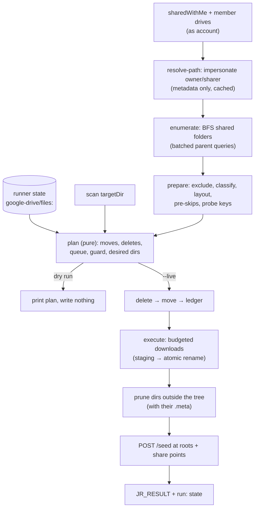

# google-drive/

Mirrors Google Drive content **shared to the assistant's Workspace account** into the content tree as text, so the watcher indexes it and jeeves-meta synthesizes it. New, changed, moved, renamed, deleted and un-shared items all propagate. Unchanged files are never re-downloaded. Downloads are budgeted per run so a large first share never overruns the schedule.

The sync is strictly **read-only** against Drive: it never writes back. Read-only is enforced by `gog --readonly` on every call (see [Safety](#safety)).

Design record: [`docs/google-drive-spec.md`](../../docs/google-drive-spec.md) (`§` references in the code point there). Verified on a live instance: sharedWithMe, nested folders, a shared drive the account isn't a member of, and an external owner.

## Scripts

| Script | Description |
| --- | --- |
| `sync.ts` | Enumerate shares → resolve paths → plan → (with `--live`) delete, move, download within budget, prune, seed metas |

## Onboarding

Do these in order on a new instance. Each step has a check.

1. **Register the assistant's own Workspace account with gog**, using the instance's existing domain-wide-delegation (DWD) key (deploy writes it to `<GOG_CONFIG_DIR>/service-account.json`):
   ```bash
   gog auth service-account set assistant@example.com --key <GOG_CONFIG_DIR>/service-account.json
   ```
   Check: `gog auth service-account status assistant@example.com`, then `gog --readonly -a assistant@example.com drive ls --all --query "sharedWithMe" --max 5 --json` returns without an auth error.
2. **Confirm the DWD grant.** In the Admin console (Security → Access and data control → API controls → Manage Domain Wide Delegation), the service account's client ID must be granted the scopes **gog requests**: `https://www.googleapis.com/auth/drive` and `https://www.googleapis.com/auth/spreadsheets`. These are _full_ scopes because gog has no read-only variants (`gog auth services`). Docs and Slides are exported through the Drive API, so they need no `documents`/`presentations` scope. Check: a `gog --readonly -a <account> sheets metadata <some shared sheet id> --json` call succeeds.
3. **Sharing settings.** For external shares: Apps → Google Workspace → Drive and Docs → Sharing settings → _"Allow users … to receive files from users or shared drives outside of …"_ must be on for the assistant's org unit. For shared drives: each drive whose items should reach the assistant needs _"Allow people who aren't shared drive members to access files"_ switched on (otherwise items can only be shared with members).
4. **Add the `googleDrive` block** to `pipeline-config.json` ([Configuration](#configuration)). The seeded config carries it as `_googleDriveExample` (ignored at runtime): rename the key and fill in `account` and `pathResolution.domains`.
5. **Do not exclude the mirror from watcher version tracking yet.** The intent is to exclude it (Drive is the system of record, and versioning the mirror duplicates its history), but `watcher_vcs_exclude` works by writing a `.gitignore`, and with `watch.respectGitignore` on, that **also removes the files from the search index**. Wait for [jeeves-watcher#253](https://github.com/karmaniverous/jeeves-watcher/issues/253) (VCS-only exclusion).
6. **Dry run** and review the plan ([Running](#running)).
7. **Register the job** with `runner_create_job` using the absolute script path. Deploy skips manifests that carry a `prerequisite`.
8. **Ask people to share** files, folders and shared drives with the assistant's address. Sharing is the whole interface; no acceptance step is needed.

## Configuration

Optional `googleDrive` block in `pipeline-config.json`. The shared config loader (`src/lib/pipeline-config.ts`) passes it through unvalidated; this job validates it (`lib/config.ts`, Zod) when it starts, so a mistake in the block fails only the Drive job, never the other jobs that load the config. No block → the job logs `[skip]` and exits 0. Only `account` and `pathResolution.domains` normally need setting.

```json
"googleDrive": {
  "budget": { "maxSeconds": 360, "maxItems": null, "maxBytes": null, "maxAttempts": 5 },
  "syncs": [
    {
      "account": "assistant@example.com",
      "targetDir": "google-drive",
      "pathResolution": { "impersonate": true, "domains": ["example.com"], "sharedDriveFallbackIdentity": null },
      "exclude": [],
      "maxFileBytes": 26214400,
      "conversion": {
        "textMimeTypes": [], "textExtensions": [], "skipMimeTypes": [],
        "sheets": { "maxRowsPerTab": 5000, "maxCellChars": 2000 }
      },
      "meta": { "seed": true, "rootSteer": null, "sharePointSteer": null, "lockStaleMinutes": 30 },
      "naming": { "maxNameBytes": null, "maxPathBytes": 4000 },
      "deletion": { "maxFraction": 0.2, "minCount": 25 }
    }
  ]
}
```

`budget` is top-level: one budget for the whole run, shared by every sync.

| Field | Default | Meaning |
| --- | --- | --- |
| `budget.maxSeconds` | 360 | Time budget for the run, measured from process start. Once it's spent, no further download starts and remaining syncs are not started; they keep their older `lastRunAt` and go first next run. Keep ≤ the job's `timeout_seconds` (720) − 60 |
| `budget.maxItems` / `maxBytes` | `null` | Optional limits on downloads attempted / bytes written, counted across all syncs in the run |
| `budget.maxAttempts` | 5 | Failures before an item is parked |
| `syncs[].account` | required | Workspace mailbox registered in gog that the sync reads as. Unique across `syncs` (it keys the ledger) |
| `targetDir` | `google-drive` | Relative to `CONTENT_DIR`, or absolute. Must resolve to a **strict subdirectory** of `CONTENT_DIR` (never `CONTENT_DIR` itself, never outside it), and must not equal or nest with another sync's `targetDir` (the default is shared, so a second sync needs its own). The sync owns and prunes that tree, so never write anything else there |
| `pathResolution.impersonate` | `true` | Impersonate owners/sharers (metadata only) to recover folder paths |
| `pathResolution.domains` | `[]` | Domains the DWD key covers; owners/sharers outside them are "external" |
| `pathResolution.sharedDriveFallbackIdentity` | `null` | Who to impersonate for a shared-drive item shared by an external user |
| `exclude` | `[]` | Globs (`path.posix.matchesGlob`, on every platform) on the item's **sanitized, untagged Drive path** (`<root>/<folder>/…/<name>`; each name sanitized as in [Output Layout and Naming](#output-layout-and-naming), so `/` or `:` inside a name becomes `_`). `<root>` is the identity email or the shared drive's name (`shared-drive <driveId>` when unreadable). Excluded = absent: not synced, deleted if previously synced |
| `maxFileBytes` | 25 MB | Uploaded files larger than this are skipped (`oversize`) |
| `conversion.textMimeTypes` / `textExtensions` / `skipMimeTypes` | `[]` | **Extend** the built-in tables in `lib/classify.ts` |
| `conversion.sheets.*` | 5000 / 2000 | Row cap per tab, character cap per cell (truncation is noted in the output) |
| `meta.seed` | `true` | Seed `.meta/` at share roots and share points |
| `meta.rootSteer` / `sharePointSteer` | `null` | Steer prompts; `null` = generic defaults (`lib/meta-seed.ts`) |
| `meta.lockStaleMinutes` | 30 | A `.meta/.lock` younger than this blocks removal of its directory (matches jeeves-meta's own stale threshold) |
| `naming.maxNameBytes` | `null` | Optional readability cap on the name part of a segment |
| `naming.maxPathBytes` | 4000 | Items whose absolute path would exceed this are skipped (`path-too-long`), never truncated into a misleading path |
| `deletion.maxFraction` / `minCount` | 0.2 / 25 | Mass-deletion guard: trips only when deletions exceed **both** |

The other fields are per sync (`syncs[].…`). A `budget` inside a sync entry is rejected with a message pointing at `googleDrive.budget`.

## Data Flow



## Output Layout and Naming

```
<targetDir>/
  mike.blaney@example.com/                 identity root (owner email, verbatim, lowercased)   ← meta
    a - k3v7q2xm/b - p5zr2a7d/              folders, each tagged                                 ← meta (share point)
      c - m2xq7b4n.txt                       native text keeps its extension
      Plan - q7d2kz4a.md                     Google Doc (Sheets, Slides alike)
      report - 3hf6wq2c.docx.md              converted binary: source extension kept visible
  Engineering - p5zr2a7d/                  shared-drive root (drive name + tag)               ← meta
  ext@example.org/                         external owner: shared item sits directly in the root
```

- **Tag** = first 8 chars of lowercase RFC 4648 base32 of `sha256(driveId)` (`TAG_SCHEME = 'sha256-b32-8'`, pinned: changing it would rename every path). Applied to every segment except identity roots. Colliding siblings lengthen to 12, then 16 chars.
- **Segment format** `<stem> - <tag><ext>`, parsed by `/ - ([a-z2-7]{8,})(\.[^/]*)?$/` (the tag is after the _last_ `-`, so names containing `-` are fine).
- **Extensions** come from the conversion class, not from splitting the name: Google-native names are never split; for uploads only a trailing `.[A-Za-z0-9]{1,10}` counts as an extension; native text without one gets an extension from its MIME type.
- **Sanitization (valid on Linux, macOS and Windows):** NFC; control characters (U+0000–U+001F, U+007F), `/` and the characters Windows forbids (`\ : * ? " < > |`) become `_`; leading/trailing whitespace and dots trimmed; empty → `untitled`; a Windows reserved device name (`CON`, `PRN`, `AUX`, `NUL`, `COM0`–`COM9`, `LPT0`–`LPT9`, with or without an extension) gets a `_` suffix (`CON` → `CON_`). Identity roots are sanitized the same way (a no-op for ordinary addresses). Each segment ≤ 255 bytes (name part truncated on a UTF-8 boundary), which also fits NTFS's 255 UTF-16 units. Tags are lowercase, so siblings never collide on case-insensitive filesystems.
- **Windows:** Node resolves long paths itself, so `naming.maxPathBytes` (4000) is the only path-length cap. Renames that replace a file another process holds open (the watcher indexing it) are retried briefly on `EPERM`/`EACCES`/`EBUSY` (`renameWithRetry` in `lib/apply.ts`).
- **Finding the Drive item for a path:** take the tag, then compute tags for candidate ids:
  ```bash
  node -e 'const c=require("crypto");const a="abcdefghijklmnopqrstuvwxyz234567";const b=c.createHash("sha256").update(process.argv[1]).digest();let bits=0,v=0,o="";for(const x of b){v=(v<<8)|x;bits+=8;while(bits>=5){o+=a[(v>>>(bits-5))&31];bits-=5}}console.log(o.slice(0,8))' <driveId>
  ```
  The `driveFileId` frontmatter field (converted/Google-native files) and the ledger hold the full id.
- **Frontmatter** (Google-native and converted files only; native text is byte-for-byte): `source`, `driveFileId`, `driveUrl`, `mimeType`, `owner`, `sharedBy`, `modifiedTime`, `drivePath`, `pathResolved`.

### Where things land

- **My Drive item, owner in `domains`:** the real folder path below the owner's `My Drive` (dropped), recovered by impersonating the owner.
- **Shared-drive item:** the real path below the drive root, recovered by impersonating the sharer. The drive's name comes from `drives.list`, because every drive's root folder is literally named `Drive`. Unreadable name → `shared-drive - <tag>`.
- **External (or unresolvable):** the shared item goes **directly in the share root** (owner email; sharer email if no owner is visible; else `unknown-owner`). Shared folders keep their child structure. An item reachable through several shares is placed once, under its fullest visible path.
- **Failed lookups are errors, not placements.** "Unresolvable" means there was nobody to impersonate (owner outside `domains`, impersonation off). When a lookup is attempted and _fails_ (the ancestor walk or `drives.list` throws), the failure counts as an enumeration error: the run deletes nothing and moves nothing (copies whose path changed are **held** where they are), so a transient Google error can't shuffle a share or drop its metas. The next clean run applies whatever the snapshot then says.

## Conversion Matrix

| Class | Detection | Method |
| --- | --- | --- |
| Google Doc | `…google-apps.document` | Drive export `md` |
| Google Sheet | `…google-apps.spreadsheet` | Sheets API, every tab → `## <tab>` + table (sized from values; grid properties report a default 1000×26) |
| Google Slides | `…google-apps.presentation` | Drive export `txt` |
| PDF | `application/pdf` | `pdf-parse` |
| Excel | `.xlsx` | `exceljs` → tables per worksheet |
| Word, PowerPoint, ODF, RTF | `.docx .pptx .odt .ods .odp .rtf` | `officeparser` → Markdown |
| Native text | `text/*`, JSON/XML/YAML/JS…, or a text extension | bytes as-is; invalid UTF-8 → skipped (`invalid-utf8`) |
| Everything else | images, media, archives, Forms, Drawings, Sites, shortcuts… | skipped (`non-convertible`) |

Permanent skips (`export-limit` for Drive exports over 10 MB, `invalid-utf8`, `oversize`, `non-convertible`, `path-too-long`) are recorded in the ledger and re-evaluated only when the file's content key changes. When an item that was already synced becomes skipped during download, its old copy is left in place and removed by the next run's plan, under the mass-deletion guard. An empty Doc exports as an empty body: that's normal.

## Tree, Shares and Metas

The **tree is canonical**, not any individual share. Shares just populate it, and they may overlap, nest or duplicate each other.

- A file exists locally iff its item is in this run's snapshot and has been written. **Any other file under `targetDir` is deleted**, whether or not the ledger knows it. Exception: dot-entries (e.g. a `.gitignore` the watcher writes) are platform-owned and left alone; synced names can never start with a dot.
- Shares are items in `sharedWithMe` **plus every shared drive the account is a member of** (membership shares the whole drive; its root is both the share root and the share point).
- A directory exists while something written or queued lives beneath it. A directory that falls out of the tree is removed **with its `.meta/`**.
- `.meta/` is seeded at each share's **root** and **share point** (a shared file's folder, or the shared folder itself) once its subtree holds a written file. A meta whose seeding share is gone **stays** while another share still keeps its directory in the tree.

Worked example: Mike shares folder `a/b` and, separately, file `a/b/c/d.txt` (metas at `<mike>`, `a/b`, `a/b/c`). Un-share the file → nothing changes (the folder still covers it). Un-share the folder too → `a/…` and all three of its metas go. Un-share only the folder → the other files under `a/b` go, but `a/b`, `a/b/c` and their metas stay.

Do not "helpfully" keep an orphaned meta or delete a live one: the planner (`lib/plan.ts`) is the authority.

## State

jeeves-runner state (`JR_DB_PATH`), namespace `google-drive`:

| Key | Type | Content |
| --- | --- | --- |
| `files:<account>` | collection, item key = Drive file id | `{ localPath, written: { contentKey, modifiedTime, kind, at }, skipped, pendingSince, attempts, lastError, retryAfter, parked, pathResolved, shareIds }` |
| `run:<account>` | scalar | full summary of the last run + `lastRunAt` |

- **Content keys:** `md5:<md5Checksum>` for uploads. For Google-native files, `rev:<latest revision id>`, checked in two stages: unchanged `modifiedTime` → reuse the stored key (no call); changed → one `revisions.list`. A rename bumps `modifiedTime` but not the revision, so it's a move, not a re-export. If revisions are unreadable, `mt:<modifiedTime>` is used instead.
- The **queue is derived**, never stored: snapshot files whose probe key ≠ `written.contentKey`, minus skipped/parked/backing-off items.
- **Reset:** `npx tsx src/google-drive/sync.ts --reset-state --live [--account <a>]`. Never a bare `deleteState`: `state_items` has a foreign key with no cascade, so deleting the parent while items exist fails. A reset just causes one full (budgeted) re-download.
- Inspect: `runner_query_state` (namespace `google-drive`, key `run:<account>`) and `runner_query_collection`.

## Running

```bash
# Dry run (default): prints MOVE / HOLD / DELETE / NEW / UPDATE / SKIP / META-CANDIDATE lines, writes nothing
JR_DB_PATH=/opt/jeeves/state/runner/runner.sqlite npx tsx src/google-drive/sync.ts
# Before a googleDrive block exists: synthesize an entry for one account
JR_DB_PATH=… npx tsx src/google-drive/sync.ts --account assistant@example.com --domains example.com
# Live (what the job runs)
JR_DB_PATH=… npx tsx src/google-drive/sync.ts --live
```

| Flag | Effect |
| --- | --- |
| `--live` | Apply changes. Without it nothing is written to disk **or** runner state, and no metas are seeded |
| `--account <email>` | Limit to one configured sync (dry run: synthesize one if not configured) |
| `--domains <a,b>` | Delegated domains for a synthesized dry-run entry |
| `--allow-mass-delete` | Apply deletions blocked by the mass-deletion guard (never ones blocked by enumeration errors) |
| `--reset-state` | Clear the ledger and run state (needs `--live`; dry run prints the count) |

`runner_trigger` always runs with the manifest's `args` (`--live`), so there is no runner-side dry run.

**Run report.** Per-item lines are sparse; every run ends with one line the runner stores: `JR_RESULT:{"meta":"<account> live shares=4 files=12 queue=0u/10n/0p done=10 failed=0 left=0 del=0f/0m moved=0 seeded=7"}` (`queue` = updates/new/parked; `left` = items deferred by the budget; `GUARD=…` appears when the guard tripped; `held=N` when moves were held back by enumeration errors).

**Exit codes.** Non-zero fires the job's `on_failure` alert and is reserved for what needs a human: invalid config, auth or enumeration failure (crash, exit 1), and a **tripped mass-deletion guard or enumeration errors** (exit 2). Parked items, unresolved paths, held locks and skips are warnings in the summary (exit 0).

**Timeouts.** The job has `timeout_seconds: 720`. On `SIGTERM` the script takes no new queue items and finishes the current one; ledger records are written per item (and per move), so a hard kill loses at most the in-flight item. The planner trusts the disk over the ledger: a recorded copy that's missing is downloaded again, and a copy already at its new path is adopted rather than moved. Native text keeps a UTF-8 BOM if it has one.

## Safety

- **Read-only Drive:** every gog call is built by `buildGogArgs()` in `lib/drive-client.ts`, which hard-codes `--readonly`. A unit test asserts it. This is the _only_ write guard: gog's tokens carry full scopes, and sharers routinely grant the account Editor.
- **Owned tree:** all filesystem paths go through `safeJoin()`, which refuses lexical escapes **and symlinks** at any component; a run also refuses a `targetDir` that is (or sits under) a symlink below `CONTENT_DIR`. `targetDir` itself is never removed. Overlapping `targetDir`s and duplicate accounts fail at startup.
- **Unseen items:** ledger records for items missing from the snapshot are dropped only when their deletions actually run. After a blocked run (enumeration error or guard), returning items find their records, so their copies aren't mistaken for strays.
- **Staging:** downloads go to `<JEEVES_BASE_DIR>/state/google-drive/tmp/<account>/` (outside the content tree, so the watcher never sees partial files), then are renamed into place. Startup verifies staging and `targetDir` share a filesystem and clears leftovers.
- **Mass-deletion guard:** deletions (files and `.meta/` directories) are skipped when enumeration had errors, or when they exceed both `deletion.maxFraction` of the files on disk and `deletion.minCount`.
- **Enumeration errors hold moves:** a run with any enumeration error (a failed folder listing, or a failed path or drive-name lookup) also moves nothing. A copy whose desired path changed stays put and its pending update waits (`HOLD` line, `heldMoves` in the summary); the next clean run moves it. Without this, a failed lookup would make every item in a share look relocated.

## Jobs

| Job                 | Schedule     | Manifest                 |
| ------------------- | ------------ | ------------------------ |
| `google-drive-sync` | Every 13 min | `jobs/google-drive.json` |

`overlap_policy: skip`, `timeout_seconds: 720`, `args: ["--live"]`. The manifest carries a non-null `prerequisite`, so deploy does not auto-register it.

## Troubleshooting

| Symptom | Diagnosis |
| --- | --- |
| `[skip] no googleDrive syncs configured` | No `googleDrive` block, or `--account` matched nothing. Check `pipeline-config.json` |
| gog error about missing credentials for the account | Onboarding step 1: `gog auth service-account status <account>` |
| `unauthorized_client` / 403 on Drive or Sheets | DWD grant missing a scope gog requests (step 2): `gog auth services` lists them |
| Files land flat under an email root | Owner outside `pathResolution.domains`, or impersonation off. Check `pathResolved` in frontmatter and `unresolvedShares` in the run state. A denied or failed impersonation shows up as an enumeration error instead (below) |
| Shared-drive root named `shared-drive - <tag>` | Drive name unreadable as the sharer: sharer external and no `sharedDriveFallbackIdentity` |
| `GUARD=mass-deletion` / exit 2 | Review the blocked deletions (`runner_query_state google-drive run:<account>`); if intended, run once with `--live --allow-mass-delete` |
| `GUARD=enumeration-error` or `held=N` / exit 2 | A folder listing, path lookup or drive-name lookup failed; see `enumerationErrors` in the run state. Deletions and moves resume when enumeration is clean. A lookup that fails every run (e.g. DWD revoked for that owner) holds that share until fixed or the owner's domain is removed from `pathResolution.domains` |
| `invalid googleDrive block` | The block failed validation (only this job stops; the message names the field). `syncs[].budget is no longer supported` → move it to the top-level `googleDrive.budget` |
| Item never updates | `runner_query_collection google-drive files:<account>` → check `skipped`, `parked`, `lastError`, `retryAfter` |
| `locks=N` in the summary | A `.meta/.lock` younger than `lockStaleMinutes` blocked a directory removal; it's retried next run. A stuck lock can be cleared with `meta_unlock` |
| Startup error about different filesystems | Staging and `targetDir` are on different mounts; `rename` wouldn't be atomic |
| Synced files on disk but not searchable | A VCS exclusion (`.gitignore` with `**`) in `targetDir` also hides it from the index; remove it (`watcher_vcs_exclude … remove: true`). Files already on disk are only indexed when they next change; see [jeeves-watcher#253](https://github.com/karmaniverous/jeeves-watcher/issues/253) |
| `targetDir … must be a subdirectory of CONTENT_DIR` | Config points at `CONTENT_DIR` itself or outside it |
| `overlapping targetDirs` / `duplicate googleDrive sync account` | Two syncs share a tree or an account; give each its own `targetDir` |
| `refusing symlink in the owned tree` | A symlink sits in or above `targetDir` (below `CONTENT_DIR`); replace it with a real directory |
| Crash | `_crash.log` in the working directory (written by `runScript`) |

## Key Files

| File | Purpose |
| --- | --- |
| `sync.ts` | CLI entry: loads the `googleDrive` block, flags, `--reset-state`, SIGTERM, the run budget, `JR_RESULT`, exit code |
| `lib/orchestrate.ts` | `selectSyncs` (config + `--account`/`--domains`), oldest-first rotation, per-sync run state |
| `lib/run-sync.ts` | One sync end to end: enumerate → prepare → plan → (live) apply, queue, prune, seed |
| `lib/report.ts` | Plan → summary fields and the per-item `MOVE`/`DELETE`/`NEW`/… lines |
| `lib/seed-metas.ts` | Which share dirs get a `.meta/`, with which steer |
| `lib/config.ts` | Zod schema and loader for the `googleDrive` block (`loadGoogleDriveConfig()`); `resolveTargetDir()` |
| `lib/drive-client.ts` | Read-only gog wrappers (`buildGogArgs` hard-codes `--readonly`); batched child listing |
| `lib/resolve-path.ts` | Share root + ancestor walk via impersonation, cached per run |
| `lib/enumerate.ts` | Remote snapshot: shares, BFS of shared folders, best placement |
| `lib/naming.ts` | Tags, sanitization, truncation, stem/extension rules, tag parsing |
| `lib/tree.ts` | Local paths, sibling tag resolution, share root/share-point dirs |
| `lib/classify.ts` | MIME/extension → conversion kind |
| `lib/content-key.ts` | md5 / two-stage revision content keys |
| `lib/prepare.ts` | Snapshot → planner input (exclude, classify, layout, pre-skips) |
| `lib/plan.ts` | Pure planner: moves (held on enumeration errors), deletes, derived queue, guard, desired dirs |
| `lib/execute.ts` | Run budget (`createRunBudget`, `budgetExhausted`), budgeted queue worker, failure/backoff/park policy |
| `lib/convert.ts`, `lib/sheets-md.ts`, `lib/frontmatter.ts` | Materialise files as text |
| `lib/apply.ts` | Filesystem ops: scan, atomic write, move (Windows-safe rename retry), prune, lock check |
| `lib/meta-seed.ts` | `POST /seed` (201 created / 409 exists) |
| `lib/ledger.ts` | Runner-state ledger (read-only in dry run), reset |
| `lib/summary.ts` | Run summary, `JR_RESULT` meta, exit code |
| `lib/*.test-helper.ts` | In-memory Drive client, runner state and planner fixtures for tests |
