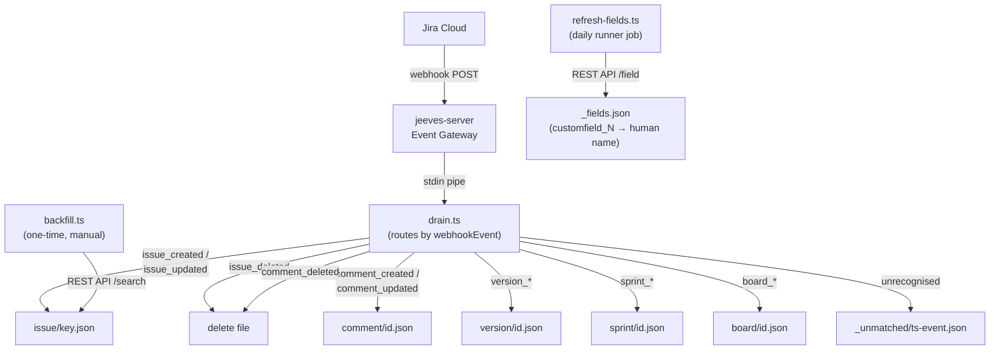

# jira/

Jira Cloud webhook drain, one-time backfill, and custom field metadata refresh.

## Overview

The Jira domain archives Jira Cloud entities — issues, comments, versions, sprints, and boards — as individual JSON files with reverse-diff change history. Two ingestion paths feed the archive:

- **Webhook drain** (`drain.ts`) — real-time stream from Jira's webhook system via the jeeves-server Event Gateway. Each incoming event is routed by `webhookEvent` type and persisted immediately.
- **Backfill** (`backfill.ts`) — one-time historical import via the Jira REST API. Run once when bootstrapping a new instance or after data loss. Existing files are skipped.

Custom field names (e.g. `customfield_10001`) are translated to human-readable aliases (e.g. `Sprint`) using a field metadata cache refreshed daily by `refresh-fields.ts`.

## Architecture



> Domain dir = `getBasePathForJira()/jira/`

## Scripts

| Script | Description |
| --- | --- |
| `drain.ts` | Webhook drain — reads stdin, routes by event type, persists entity snapshots |
| `backfill.ts` | One-time historical import via Jira REST API (`--project KEY [--type issue] [--live]`) |
| `refresh-fields.ts` | Fetch field metadata and write `_fields.json` (daily runner job) |
| `sort-backlog.ts` | Stable-sort the Jira backlog by priority group (`--live` to execute, dry-run by default) |

Supporting modules in `lib/`:

| Module | Description |
| --- | --- |
| `../lib/entity-store.ts` | `upsertEntity`, `backfillEntity`, `deleteEntity`, `writeUnmatched`, `readStdinJson` — shared file I/O with diff history (see [entity-store docs](../lib/README.md#entity-storets)) |
| `lib/jira-client.ts` | `jiraGet`, `searchIssues` — typed Jira REST API v3 client |

## Archive Structure

```
{CONTENT_DIR}/jira/          ← or silo basePath/jira/ in multi-tenant
  issue/
    WEB-1.json
    WEB-2.json
    ...
  comment/
    12345.json
    ...
  version/
    67890.json
    ...
  sprint/
    1001.json
    ...
  board/
    2001.json
    ...
  _fields.json                ← custom field name map (written by refresh-fields)
  _unmatched/                 ← raw payloads for events not yet routed
    1718800000000-unknown_event.json
```

### Entity Key Extraction

| Entity Type | Payload Object | Key Field | Example File         |
| ----------- | -------------- | --------- | -------------------- |
| `issue`     | `body.issue`   | `key`     | `issue/WEB-1.json`   |
| `comment`   | `body.comment` | `id`      | `comment/12345.json` |
| `version`   | `body.version` | `id`      | `version/67890.json` |
| `sprint`    | `body.sprint`  | `id`      | `sprint/1001.json`   |
| `board`     | `body.board`   | `id`      | `board/2001.json`    |

### Entity File Format

Each entity file is a JSON object with the following structure:

```json
{
  "entityType": "issue",
  "entityKey": "WEB-1",
  "current": { "...": "full Jira payload snapshot" },
  "history": [
    {
      "ts": "2026-01-15T10:00:00.000Z",
      "patch": [
        {
          "op": "replace",
          "path": "/fields/status/name",
          "value": "In Progress"
        }
      ]
    }
  ],
  "meta": {
    "firstSeen": "2026-01-10T08:00:00.000Z",
    "lastWebhook": "2026-01-15T10:00:00.000Z",
    "lastBackfill": null,
    "version": 7
  }
}
```

**Reverse-diff model:** `history` entries are JSON patches that transform the **current** snapshot back to the **previous** state. Apply patches in order from newest to oldest to reconstruct any prior state.

## Webhook Setup

1. In Jira Cloud, go to **Settings → System → WebHooks**.
2. Click **Create a WebHook**.
3. **URL:** `https://your-jeeves-server.example.com/api/events/jira` (see Event Gateway Config below for the exact path pattern).
4. **Events to send:** Select all issue events, comment events, and any additional entity types (version, sprint, board) you want to archive.
5. **JQL filter (optional):** Limit to specific projects, e.g. `project in (WEB, API)`.
6. Save. Jira immediately starts delivering events.

> **Note:** Jira Cloud webhooks deliver events within seconds. There is no replay mechanism — events missed while the gateway is down will not be redelivered. Run the backfill script after any extended downtime.

## Event Gateway Config

Add this block to your jeeves-server Event Gateway configuration:

```jsonc
{
  "eventGateway": {
    "schemas": [
      {
        "pattern": "jira",
        "cmd": ["tsx", "{SCRIPTS_DIR}/src/jira/drain.ts"],
        "timeoutMs": 10000,
      },
    ],
  },
}
```

- `{SCRIPTS_DIR}` — absolute path to the scripts repo checkout (from `SCRIPTS_DIR` in `constants.ts`)
- `pattern` — must match the path segment used in the webhook URL (e.g. `/api/events/jira`)
- `timeoutMs` — 10 seconds is ample; drain scripts are fast I/O-only operations

The gateway pipes the raw HTTP request body to the script's stdin and captures stdout/stderr for logging.

## Custom Field Translation

Jira stores custom fields as `customfield_N` keys. The drain script enriches issue payloads with human-readable aliases using a field map stored in `_fields.json`:

```json
{
  "customfield_10001": "Sprint",
  "customfield_10014": "Epic Link",
  "customfield_10020": "Story point estimate"
}
```

The map is updated daily by `refresh-fields.ts` (scheduled runner job). After an alias is added to `_fields.json`, all new webhook events will include both the raw key and the alias:

```json
{
  "customfield_10001": { "id": "42", "name": "Sprint 7" },
  "Sprint": { "id": "42", "name": "Sprint 7" }
}
```

## Backfill

Run the backfill once after setting up the webhook to populate historical data:

```bash
# Dry run (preview — no writes)
tsx src/jira/backfill.ts --project WEB

# Live run (actual writes)
tsx src/jira/backfill.ts --project WEB --live

# Backfill a different entity type (future)
tsx src/jira/backfill.ts --project WEB --type issue --live
```

**CLI arguments:**

| Argument        | Default      | Description                                |
| --------------- | ------------ | ------------------------------------------ |
| `--project KEY` | _(required)_ | Jira project key (e.g. `WEB`)              |
| `--type TYPE`   | `issue`      | Entity type to backfill                    |
| `--live`        | false        | Perform actual writes (dry-run by default) |

**Rate limiting:** 200 ms pause between API requests to avoid hitting Jira Cloud rate limits.

**Skip behaviour:** The backfill skips any entity file that already exists on disk. This ensures webhook-delivered data (which is fresher) is never overwritten by the backfill.

## Prerequisites

| Prerequisite | Where to configure |
| --- | --- |
| Jira Cloud account with API token | [id.atlassian.com → API tokens](https://id.atlassian.com/manage-profile/security/api-tokens) |
| `JIRA_SITE_URL` | `src/lib/constants.ts` — e.g. `'https://mysite.atlassian.net'` |
| `JIRA_EMAIL` | `src/lib/constants.ts` — Atlassian account email |
| `JIRA_API_TOKEN_PATH` | `src/lib/constants.ts` — path to API token file |
| Jira webhook configured to POST to jeeves-server | Jira Cloud → Settings → System → WebHooks |
| jeeves-server Event Gateway configured with `jira` schema | `jeeves-server` config (see Event Gateway Config above) |
| `JIRA_BOARD_ID` env var | Environment variable — numeric Jira Agile board ID for sort-backlog |

## Key Files

| File | Purpose |
| --- | --- |
| `drain.ts` | Webhook drain entry point — stdin pipe from Event Gateway |
| `backfill.ts` | One-time historical backfill via REST API |
| `refresh-fields.ts` | Daily custom field metadata refresh |
| `sort-backlog.ts` | Backlog priority sort — stable re-rank by priority group via Agile API |
| `../lib/entity-store.ts` | Shared file I/O helpers with reverse-diff history — `upsertEntity`, `backfillEntity`, `deleteEntity`, `writeUnmatched`, `readStdinJson` (see [entity-store docs](../lib/README.md#entity-storets)) |
| `lib/jira-client.ts` | Typed Jira REST API v3 client (fetch, paginate) |
| `../../jobs/jira.json` | Runner job manifest (refresh-fields schedule) |
| `../../src/lib/constants.ts` | Jira constants (`JIRA_SITE_URL`, `JIRA_EMAIL`, etc.) |
