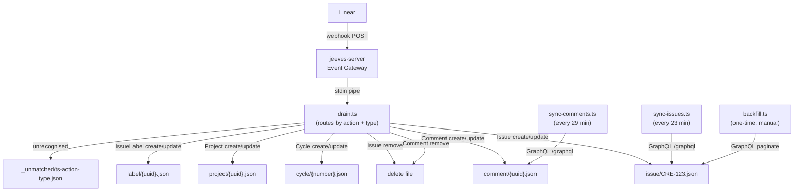

# linear/

Linear webhook drain, polling sync, and one-time backfill.

## Overview

The Linear domain archives Linear entities — issues, comments, cycles, projects, and labels — as individual JSON files with reverse-diff change history. Three ingestion paths feed the archive:

- **Webhook drain** (`drain.ts`) — real-time stream from Linear's webhook system via the jeeves-server Event Gateway. Each incoming event is routed by `action` + `type` and persisted immediately.
- **Polling sync** (`sync-issues.ts`, `sync-comments.ts`) — scheduled runner jobs that poll the Linear GraphQL API for changes since the last cursor. Fills in any gaps when webhooks are missed.
- **Backfill** (`backfill.ts`) — one-time historical import via the Linear GraphQL API. Run once when bootstrapping a new instance or after data loss. Existing files are skipped.

Linear uses human-readable field names natively — no custom field translation is needed.

## Architecture



> Domain dir = `getBasePathForLinear()/linear/`

## Scripts

| Script | Description |
| --- | --- |
| `drain.ts` | Webhook drain — reads stdin, routes by action + type, persists entity snapshots |
| `sync-issues.ts` | Polling sync for issues — runner job, every 23 minutes |
| `sync-comments.ts` | Polling sync for comments — runner job, every 29 minutes |
| `backfill.ts` | One-time historical import via GraphQL (`--team KEY [--type issue\|comment] [--live]`) |

Supporting modules in `lib/`:

| Module | Description |
| --- | --- |
| `lib/linear-client.ts` | `loadConfig`, `linearQuery`, `paginateIssues`, `paginateComments`, `enrichComment`, `sleepMs` — typed GraphQL client and helpers |
| `../lib/entity-store.ts` | `upsertEntity`, `backfillEntity`, `deleteEntity`, `writeUnmatched`, `readStdinJson` — shared file I/O with diff history (see [entity-store docs](../lib/README.md#entity-storets)) |

## Archive Structure

```
{CONTENT_DIR}/linear/          ← or silo basePath/linear/ in multi-tenant
  issue/
    CRE-1.json
    CRE-2.json
    ...
  comment/
    {uuid}.json
    ...
  cycle/
    1.json
    2.json
    ...
  project/
    {uuid}.json
    ...
  label/
    {uuid}.json
    ...
  _unmatched/                  ← raw payloads for events not yet routed
    1718800000000-create-Unknown.json
```

### Entity Key Extraction

| Entity Type | Payload Object | Key Field    | Example File          |
| ----------- | -------------- | ------------ | --------------------- |
| `issue`     | `body.data`    | `identifier` | `issue/CRE-1.json`    |
| `comment`   | `body.data`    | `id`         | `comment/{uuid}.json` |
| `cycle`     | `body.data`    | `number`     | `cycle/1.json`        |
| `project`   | `body.data`    | `id`         | `project/{uuid}.json` |
| `label`     | `body.data`    | `id`         | `label/{uuid}.json`   |

### Entity File Format

Each entity file is a JSON object with the following structure:

```json
{
  "entityType": "issue",
  "entityKey": "CRE-1",
  "current": {
    "id": "abc123",
    "identifier": "CRE-1",
    "title": "Fix login bug",
    "state": { "id": "...", "name": "In Progress", "type": "started" },
    "assignee": {
      "id": "...",
      "name": "Jane Smith",
      "email": "jane@example.com"
    },
    "priority": 2,
    "priorityLabel": "High",
    "updatedAt": "2026-06-29T11:00:00.000Z"
  },
  "history": [
    {
      "ts": "2026-06-28T10:00:00.000Z",
      "patch": [{ "op": "replace", "path": "/state/name", "value": "Todo" }]
    }
  ],
  "meta": {
    "firstSeen": "2026-06-01T08:00:00.000Z",
    "lastWebhook": "2026-06-29T11:00:00.000Z",
    "lastBackfill": null,
    "version": 7
  }
}
```

**Reverse-diff model:** `history` entries are JSON patches that transform the **current** snapshot back to the **previous** state. Apply patches in order from newest to oldest to reconstruct any prior state.

## Webhook Payload Format

Linear delivers payloads with an `action` + `type` discriminator (unlike Jira's `webhookEvent`):

```json
{
  "action": "create",
  "type": "Issue",
  "data": {
    "id": "abc123",
    "identifier": "CRE-1",
    "title": "Fix login bug",
    "...": "..."
  },
  "url": "https://linear.app/team/issue/CRE-1",
  "createdAt": "2026-06-29T11:00:00.000Z"
}
```

Action values: `"create"`, `"update"`, `"remove"`

Type values: `"Issue"`, `"Comment"`, `"Cycle"`, `"Project"`, `"IssueLabel"`

## Webhook Setup

1. In Linear, go to **Settings → API → Webhooks**.
2. Click **New webhook**.
3. **URL:** `https://your-jeeves-server.example.com/event?key=<event-key>` (all event types share the same endpoint; routing is body-based via schema matching)
4. **Events:** Select Issue, Comment, Cycle, Project, IssueLabel events.
5. Optionally add a **Signing secret** — store it as `webhookSecret` in LINEAR_CONFIG_PATH.
6. Save. Linear immediately starts delivering events.

> **Note:** Linear webhooks deliver events within seconds. There is no replay mechanism — events missed while the gateway is down will not be redelivered. The polling sync jobs (`sync-issues.ts`, `sync-comments.ts`) fill in missed windows automatically.

## Event Gateway Config

Add this block to your jeeves-server Event Gateway configuration:

```jsonc
{
  "events": {
    "linear": {
      "schema": {
        "type": "object",
        "required": ["action", "type"],
        "properties": {
          "action": { "type": "string" },
          "type": { "type": "string" },
        },
      },
      "cmd": "tsx {SCRIPTS_DIR}/src/linear/drain.ts",
      "timeoutMs": 10000,
    },
  },
}
```

- `{SCRIPTS_DIR}` — absolute path to the scripts repo checkout (from `SCRIPTS_DIR` in `constants.ts`)
- `schema` — JSON Schema validated against the POST body (ajv, first match wins across all configured events)
- `cmd` — the server spawns this command and pipes the request body JSON to stdin
- `timeoutMs` — kill timeout for the drain process (falls back to global `eventTimeoutMs`)

> **Webhook URL:** `POST https://<instance>/event?key=<event-key>` — all event types share the same endpoint; routing is body-based via schema matching. This is the same pattern used by the Jira drain.

## Polling Sync

The two sync jobs use runner scalar state to track a cursor (ISO timestamp of the most recently seen `updatedAt`):

| Job                | State namespace | State key              | Schedule     |
| ------------------ | --------------- | ---------------------- | ------------ |
| `sync-issues.ts`   | `linear`        | `sync-issues-cursor`   | Every 23 min |
| `sync-comments.ts` | `linear`        | `sync-comments-cursor` | Every 29 min |

On first run (no cursor), all issues/comments are fetched from the beginning. On subsequent runs, only entities updated since the last cursor are fetched. Rate-limited at 200 ms between pages.

## Backfill

Run the backfill once after setting up the webhook to populate historical data:

```bash
# Dry run (preview — no writes)
tsx src/linear/backfill.ts --team CRE

# Live run (actual writes)
tsx src/linear/backfill.ts --team CRE --live

# Backfill comments (no team filter needed)
tsx src/linear/backfill.ts --type comment --live
```

**CLI arguments:**

| Argument | Default | Description |
| --- | --- | --- |
| `--team KEY` | _(required for issue)_ | Linear team key (e.g. `CRE`) |
| `--type TYPE` | `issue` | Entity type: `issue` or `comment` |
| `--live` | false | Perform actual writes (dry-run by default) |

**Rate limiting:** 200 ms pause between API pages to avoid hitting Linear rate limits.

**Skip behaviour:** The backfill skips any entity file that already exists on disk. This ensures sync/webhook-delivered data (which is fresher) is never overwritten by the backfill.

## API Client

The GraphQL client in `lib/linear-client.ts` uses Linear's standard GraphQL endpoint with plain `Authorization: <key>` header (not Bearer). No extra dependencies — uses Node's built-in `fetch`.

Key differences from the Jira client:

- **GraphQL** (POST to `config.apiUrl`) instead of REST (GET)
- **Plain API key** (`Authorization: <key>`, not Bearer) instead of Basic auth
- **Cursor pagination** (`after: $cursor`, `pageInfo.endCursor`) instead of offset pagination
- **Human-readable names** everywhere — no field ID translation needed
- **Markdown bodies** natively — no ADF conversion

## Watcher Configuration

Linear entities require watcher inference rules and maps before they appear in semantic search. These are _instance-side_ watcher config, not template code.

**Inference rules** (4 required):

- `linear-issue` — matches `linear/issue/*.json`
- `linear-comment` — matches `linear/comment/*.json`
- `linear-cycle` — matches `linear/cycle/*.json`
- `linear-project` — matches `linear/project/*.json`

**Maps** (2 required):

- `linear-issue` — extracts issue fields (identifier, title, state, assignee, priority)
- `linear-comment` — extracts comment fields (body, user, issue reference)

Tracked as [jeeves-tools #99](https://github.com/karmaniverous/jeeves-tools/issues/99).

**Meta autoSeed** entries for automatic `.meta/` directory creation on new Linear entities are tracked as [jeeves-tools #98](https://github.com/karmaniverous/jeeves-tools/issues/98).

## Prerequisites

| Prerequisite | Where to configure |
| --- | --- |
| Linear API key | [Linear Settings → API → Personal API keys](https://linear.app/settings/api) |
| `LINEAR_CONFIG_PATH` | `src/lib/constants.ts` — default: `/opt/jeeves/config/linear/config.json` |
| Config file format | `{ "apiKey": "lin_api_...", "apiUrl": "https://api.linear.app/graphql" }` |
| Linear webhook configured to POST to jeeves-server | Linear Settings → API → Webhooks |
| jeeves-server Event Gateway configured with `linear` schema | `jeeves-server` config (see Event Gateway Config above) |
| Watcher inference rules + maps for Linear entities | Instance watcher config ([jeeves-tools #99](https://github.com/karmaniverous/jeeves-tools/issues/99)) |
| Meta autoSeed entries for Linear entity discovery | Instance meta config ([jeeves-tools #98](https://github.com/karmaniverous/jeeves-tools/issues/98)) |

## Key Files

| File | Purpose |
| --- | --- |
| `drain.ts` | Webhook drain entry point — stdin pipe from Event Gateway |
| `sync-issues.ts` | Polling sync for issues (runner job, every 23 min) |
| `sync-comments.ts` | Polling sync for comments (runner job, every 29 min) |
| `backfill.ts` | One-time historical backfill via GraphQL API |
| `lib/linear-client.ts` | Typed Linear GraphQL client (fetch, paginate) |
| `../lib/entity-store.ts` | File I/O helpers with reverse-diff history (shared with Jira) |
| `../../jobs/linear.json` | Runner job manifest (sync-issues, sync-comments schedules) |
| `../../src/lib/constants.ts` | Linear constants (`LINEAR_CONFIG_PATH`, `LINEAR_MAX_HISTORY`) |
