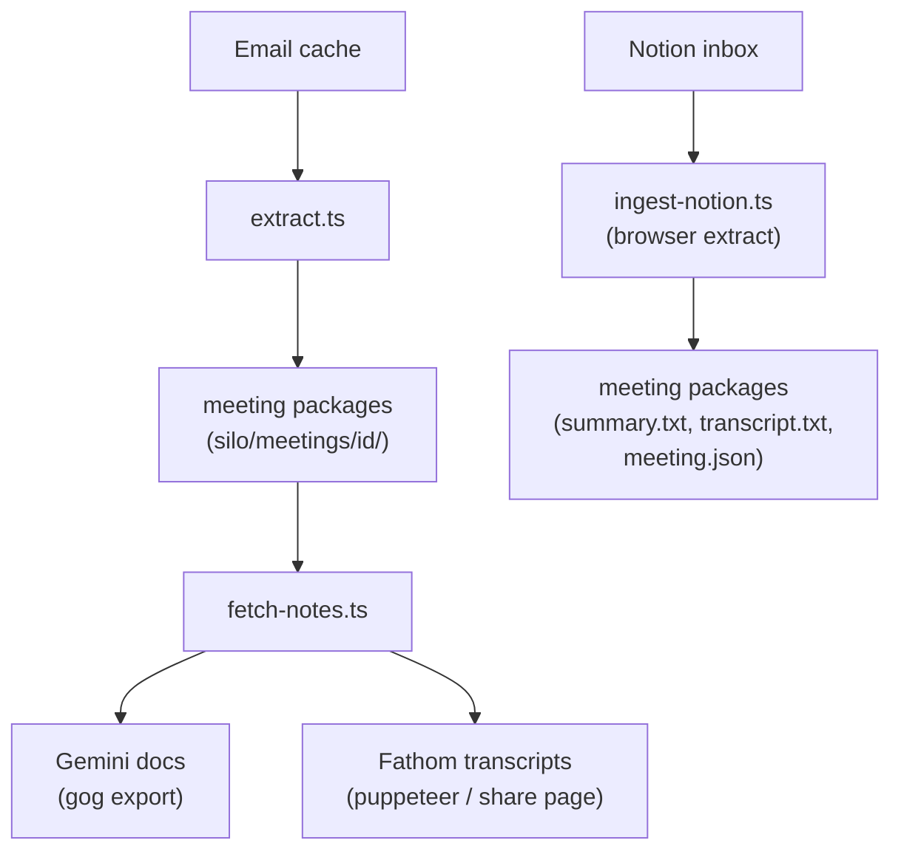

# meetings/

Meeting extraction from three independent sources — Google Meet (via email), Fathom recordings, and Notion inbox — writing to a shared entity store. This domain is the exemplar for the entity pipeline pattern.

## Scripts

| Script | Description |
| --- | --- |
| `extract.ts` | Scans the email cache for meeting-related threads, detects source (Google Meet, Fathom), creates meeting packages with metadata and artifacts |
| `fetch-notes.ts` | Walks meeting directories, fetches Gemini doc transcripts and Fathom transcripts for meetings that need them |
| `ingest-notion.ts` | Polls a Notion inbox database, fetches meeting content via browser extraction, stages artifacts locally, archives the inbox page |
| `migrate-alignment.ts` | One-shot: brings existing meeting packages into conformance with the canonical meeting-package contract |
| `migrate-fathom.ts` | One-shot: remediates existing Fathom meetings — re-detects URLs, reclassifies, fetches missing transcripts |

## Data Flow

### Meeting Package Structure

Each meeting lives in a directory under `{silo}/meetings/{meetingId}/`:

- `meeting.json` — canonical metadata (Zod-validated via `meeting-schema.ts`)
- `transcript.txt` — extracted transcript (from Gemini, Fathom, or Notion)
- `summary.txt` — meeting summary (from Fathom or Notion)
- `gemini_link.txt` — Google Meet Gemini doc URL
- `fathom-*.html` — raw Fathom email HTML
- Source email JSON files

### Three Independent Extractors

1. **Google Meet** (via email): Detects meeting invitations/summaries in email, extracts participants, creates packages, fetches Gemini doc transcripts via `gog`
2. **Fathom** (via email + share pages): Detects Fathom recording URLs in email bodies, fetches transcripts from public share pages using puppeteer-core with headless Chrome
3. **Notion** (via API + browser): Queries a Notion inbox database, extracts content (Summary/Notes/Transcript tabs) via gateway browser tool, archives processed pages

## Prerequisites

- Gmail OAuth via `gog` (email pipeline must be running for extract/fetch-notes)
- For Notion ingestion: `NOTION_API_KEY_PATH` and inbox database ID in pipeline-config refs (see [Configuration Files](../lib/README.md#configuration-files) for `pipeline-config.json` schema and creation instructions)
- Chrome installed (for Fathom share page extraction via puppeteer-core)

| Job                      | Schedule                           |
| ------------------------ | ---------------------------------- |
| `meetings-extract`       | Every 13 min                       |
| `meetings-fetch-notes`   | Every 19 min                       |
| `meetings-ingest-notion` | Every 23 min (disabled by default) |

## Key Files

| File | Purpose |
| --- | --- |
| `lib/meeting-schema.ts` | Canonical meeting.json Zod schema, `writeMeetingMeta()`, sort timestamp computation |
| `lib/detect.ts` | Meeting detection — subject matching, title normalization, participant extraction, Fathom URL detection, meeting ID generation |
| `lib/package.ts` | Creates/updates meeting package directories and artifacts, manages runner-state index |
| `lib/meetings-dirs.ts` | Discovers all meetings directories across silos via `getEntityDirs()` |
| `lib/doc-fetch.ts` | Fetches Google Doc transcripts via `gog` CLI for meetings with `gemini_link.txt` |
| `lib/fathom-extract.ts` | Extracts transcripts from `fathom-*.html` files into `transcript.txt` |
| `lib/fathom-share-fetch.ts` | Fetches summary/transcript from public Fathom share pages using puppeteer-core |
| `lib/fathom-share-dom.ts` | Pure DOM extraction helpers for Fathom share page content |
| `lib/fathom-share-ingest.ts` | Pipeline for Fathom share meetings needing transcript fetching |
| `lib/notion-api.ts` | Notion API HTTP helpers with authentication |
| `lib/notion-browser-extract.ts` | Extracts meeting content from Notion public pages via gateway browser tool |
| `lib/notion-inbox-processor.ts` | Processes a Notion inbox page end-to-end: fetch, extract, stage, archive |
| `lib/meeting-cursor.ts` | Cursor and sort logic for global meetings meta steering |
| `lib/migration-args.ts` | Shared CLI argument parsing for migration scripts (`--live`, `--max`) |
| `lib/migration-backup.ts` | Backup and reversibility utilities for migrations |
