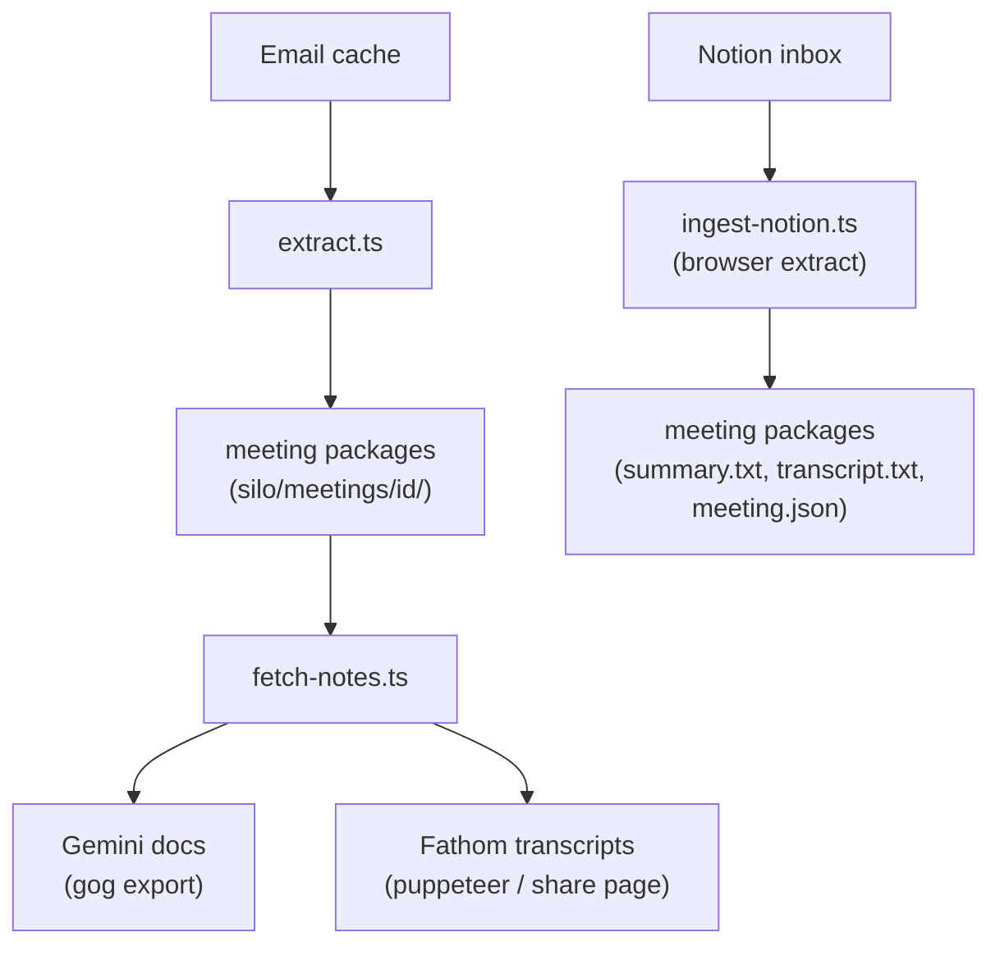

# meetings/

Meeting extraction from three independent sources — Google Meet (via email), Fathom recordings, and Notion inbox — writing to a shared entity store. This domain is the exemplar for the entity pipeline pattern.

## Scripts

| Script | Description |
| --- | --- |
| `extract.ts` | Scans the email cache for meeting-related threads, detects source (Google Meet, Fathom), creates meeting packages with metadata and artifacts. For each new meeting it enqueues the Gmail `meeting` label (plus an archive if the message is in the inbox and not labelled `watch`, unless `emailConfig.meetings.archive` is `false`; see [lib/](../lib/README.md)) on `email-updates` through the email pipeline's `label-actions.ts`, so nothing is enqueued when `emailConfig.reportOnly` is true. Those actions are deferred, not dropped: see [reportOnly catch-up](#reportonly-catch-up). Gemini transcripts are not fetched here; the package gets `gemini_link.txt` and `fetch-notes.ts` exports the Doc |
| `fetch-notes.ts` | Walks meeting directories, fetches Gemini doc transcripts (exported as the meeting's source mailbox, `meeting.json` `sources[0].account`) and Fathom transcripts for meetings that need them |
| `ingest-notion.ts` | Polls a Notion inbox database, fetches meeting content via browser extraction, stages artifacts locally, archives the inbox page |
| `migrate-alignment.ts` | One-shot: brings existing meeting packages into conformance with the canonical meeting-package contract |
| `migrate-fathom.ts` | One-shot: remediates existing Fathom meetings — re-detects URLs, reclassifies, fetches missing transcripts |

## Data Flow

```mermaid
flowchart TD
  email["Email cache"] --> extract["extract.ts"]
  extract --> packages["meeting packages\n(silo/meetings/id/)"]
  packages --> fetch["fetch-notes.ts"]
  fetch --> gemini["Gemini docs\n(gog export)"]
  fetch --> fathom["Fathom transcripts\n(puppeteer / share page)"]

  notion["Notion inbox"] --> ingest["ingest-notion.ts\n(browser extract)"]
  ingest --> notionPkg["meeting packages\n(summary.txt, transcript.txt,\nmeeting.json)"]
```

### Meeting Package Structure

Each meeting lives in a directory under `{silo}/meetings/{meetingId}/`:

- `meeting.json` — canonical metadata (Zod-validated via `meeting-schema.ts`)
- `transcript.txt` — extracted transcript (from Gemini, Fathom, or Notion)
- `summary.txt` — meeting summary (from Fathom or Notion)
- `gemini_link.txt` — Google Meet Gemini doc URL
- `fathom-*.html` — raw Fathom email HTML
- Source email JSON files

### Three Independent Extractors

1. **Google Meet** (via email): Detects meeting invitations/summaries in email, extracts participants, creates packages with `gemini_link.txt`; `fetch-notes.ts` then exports the Gemini doc transcript via `gog` as the meeting's source mailbox
2. **Fathom** (via email + share pages): Detects Fathom recording URLs in email bodies, fetches transcripts from public share pages using puppeteer-core with headless Chrome
3. **Notion** (via API + browser): Queries a Notion inbox database, extracts content (Summary/Notes/Transcript tabs) via gateway browser tool, archives processed pages

## Prerequisites

- Gmail OAuth via `gog` (email pipeline must be running for extract/fetch-notes)
- For Notion ingestion: `NOTION_API_KEY_PATH` and inbox database ID in pipeline-config refs (see [Configuration Files](../lib/README.md#configuration-files) for `pipeline-config.json` schema and creation instructions)
- Chrome installed (for Fathom share page extraction via puppeteer-core)

| Job                      | Schedule                           |
| ------------------------ | ---------------------------------- |
| `meetings-extract`       | Every 13 min                       |
| `meetings-fetch-notes`   | Every 19 min                       |
| `meetings-ingest-notion` | Every 23 min (disabled by default) |

## Key Files

| File | Purpose |
| --- | --- |
| `lib/meeting-schema.ts` | Canonical meeting.json Zod schema, `writeMeetingMeta()`, sort timestamp computation |
| `lib/detect.ts` | Meeting detection — subject matching, title normalization, participant extraction, Fathom URL detection, meeting ID generation |
| `lib/email-actions.ts` | Gmail actions for a new meeting (`meeting` label, archive if in the inbox and not `watch`ed; archive switchable via `emailConfig.meetings.archive`), enqueued via `enqueueEmailUpdates` (the `reportOnly` gate) |
| `lib/pending-actions.ts` | Defers a new meeting's Gmail actions while `reportOnly` is on and catches them up afterwards (see [reportOnly catch-up](#reportonly-catch-up)) |
| `lib/package.ts` | Creates/updates meeting package directories and artifacts, manages runner-state index |
| `lib/meetings-dirs.ts` | Discovers all meetings directories across silos via `getEntityDirs()` |
| `lib/doc-fetch.ts` | Fetches Google Doc transcripts via `gog` CLI for meetings with `gemini_link.txt` |
| `lib/fathom-extract.ts` | Extracts transcripts from `fathom-*.html` files into `transcript.txt` |
| `lib/fathom-share-fetch.ts` | Fetches summary/transcript from public Fathom share pages using puppeteer-core |
| `lib/fathom-share-dom.ts` | Pure DOM extraction helpers for Fathom share page content |
| `lib/fathom-share-ingest.ts` | Pipeline for Fathom share meetings needing transcript fetching |
| `lib/notion-api.ts` | Notion API HTTP helpers with authentication |
| `lib/notion-browser-extract.ts` | Extracts meeting content from Notion public pages via gateway browser tool |
| `lib/notion-inbox-processor.ts` | Processes a Notion inbox page end-to-end: fetch, extract, stage, archive |
| `lib/meeting-cursor.ts` | Cursor and sort logic for global meetings meta steering |
| `lib/migration-args.ts` | Shared CLI argument parsing for migration scripts (`--live`, `--max`) |
| `lib/migration-backup.ts` | Backup and reversibility utilities for migrations |

## reportOnly catch-up

While `emailConfig.reportOnly` is `true`, `extract.ts` still packages new meetings but enqueues none of their Gmail actions. Instead it records each new meeting as pending (runner state namespace `meetings`, collection `pendingEmailActions`, keyed by source key).

Once `reportOnly` is `false`, each run catches up to 20 pending meetings (`CATCH_UP_PER_RUN` in `lib/pending-actions.ts`), so a long `reportOnly` window drains gradually:

- Actions are built from the message's **current** labels in the thread cache. A message a human has since labelled `watch`, or already moved out of the inbox, is not archived. A message no longer in the cache gets the `meeting` label only.
- The current `emailConfig.meetings.archive` setting applies.
- Everything goes through `enqueueEmailUpdates`, the single `reportOnly` gate. A meeting's pending record is removed once its actions are enqueued, so nothing is enqueued twice.

Only meetings packaged under `reportOnly` after this behaviour was introduced are pending. Meetings packaged earlier have no record and are never caught up, so turning `reportOnly` off can't mass-archive old mail. A pending record that can't be read is moved, unchanged, to the `pendingEmailActionsInvalid` collection (same namespace) and named in a `WARNING` line in the run log. It is never retried: inspect it, then re-create or delete it by hand. To discard pending actions instead of applying them, delete the `pendingEmailActions` items in the `meetings` namespace before turning `reportOnly` off.
