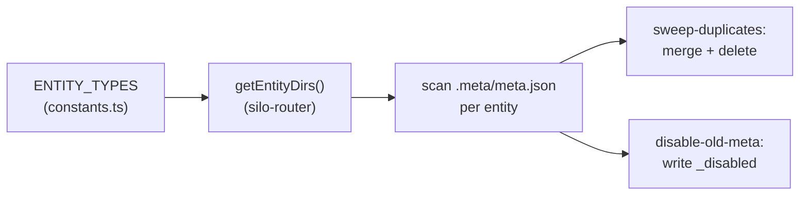

# meta/

Entity lifecycle maintenance — sweeps duplicate entities and disables stale metadata entries.

## Scripts

| Script | Description |
| --- | --- |
| `sweep-duplicates.ts` | Scans entity directories for rejections (deletes entity) and duplicates (merges files into original, then deletes duplicate). Uses copy + delete instead of move because watcher holds file locks. |
| `disable-old-meta.ts` | Disables stale meta entries for time-bounded entity types. If an entity's date exceeds `maxAgeDays` and synthesis is complete (`_content` exists), writes `_disabled: true` to prevent further synthesis scheduling. |

## Data Flow

- Both scripts loop over `ENTITY_TYPES` from constants, which defines `subdir`, `rejectionKeys`, and `maxAgeDays` per entity type.
- Directory resolution uses `getEntityDirs()` from silo-router to find entity roots across all silos.
- **sweep-duplicates** recognizes multiple case variants of `duplicateOf` keys and resolves values to absolute directory paths (bare hex IDs, full paths, or partial paths).
- **disable-old-meta** extracts dates from meta fields or `_content` headers and compares against `maxAgeDays`.

## Prerequisites

No external prerequisites. Operates on local filesystem entity directories.

| Job                     | Schedule           |
| ----------------------- | ------------------ |
| `meta-sweep-duplicates` | Every 29 min       |
| `meta-disable-old`      | Daily at 04:11 UTC |

## Key Files

| File | Purpose |
| --- | --- |
| `../lib/constants.ts` | `ENTITY_TYPES` array defining entity type config |
| `../lib/silo-router.ts` | `getEntityDirs()` for cross-silo directory discovery |
