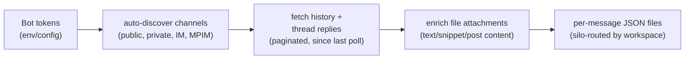

# slack/

Polls Slack channels for new messages across configured workspaces, auto-discovers channels the bot has joined, and writes per-message JSON archives.

## Scripts

| Script | Description |
| --- | --- |
| `poll.ts` | Auto-discovers channels, fetches history and thread replies via Slack API, writes individual JSON files per message to silo-routed directories. Supports multi-account/multi-workspace scenarios. |

## Data Flow

- Loads Slack bot tokens from environment or `.openclaw/openclaw.json` / `.clawdbot/clawdbot.json` config files.
- Auto-discovers all channel types the bot is a member of (public, private, IM, MPIM), excluding archived.
- Fetches paginated conversation history since last poll timestamp per channel.
- Fetches thread replies for threaded messages.
- Enriches text-extractable file attachments (`text`, `post`, `snippet`) by fetching content via `files.info` + `url_private_download` and inlining as `files[].markdown`.
- Persists structured `files[]` metadata (id, name, filetype, mimetype, size) alongside `hasFiles` flag.
- Captures voice memo transcripts from Slack's native transcription (`files[].transcript`).
- Writes one JSON file per message under `{silo}/slack/{channelName}/`.
- Handles channel renames by detecting and renaming the output directory.
- Resolves workspace routing via `getBasePathForSlackWorkspace()` for multi-workspace setups.
- Loads user ID → username mappings from `users.json` for message enrichment.

## Prerequisites

- Slack bot token configured (via environment variable or config file)
- `PRIMARY_WORKSPACE`, `SLACK_DOMAIN_DIR`, `SLACK_WORKSPACE_CACHE_PATH` set in `constants.ts`

| Job          | Schedule     |
| ------------ | ------------ |
| `slack-poll` | Every 11 min |

## Key Files

| File | Purpose |
| --- | --- |
| `lib/slack-api.ts` | Typed Slack Web API wrappers — `fetchHistory()`, `fetchReplies()`, `discoverChannels()`, `slackApi()`, `SlackFileMetadata` type, with pagination |
| `../lib/constants.ts` | Workspace routing constants |
| `../lib/silo-router.ts` | `getBasePathForSlackWorkspace()` for output directory routing (see [Configuration Files](../lib/README.md#configuration-files) for `silo-routing.json` schema) |
| `lib/map-helpers.cjs` | CommonJS helper for mapping Slack channel/user IDs to names. Used by watcher inference rules for enriching indexed message metadata |
| `lib/channels.json` | Cached channel metadata (sanitized stubs in template). Updated at runtime by `poll.ts` |
| `lib/users.json` | Cached user ID → username mapping (sanitized stubs in template). Used by `poll.ts` for message enrichment |
