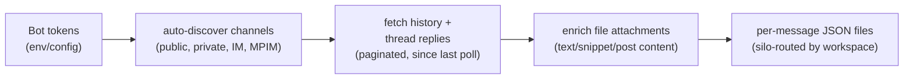

# slack/

Polls Slack channels for new messages across configured workspaces, auto-discovers channels the bot has joined, and writes per-message JSON archives.

## Scripts

| Script | Description |
| --- | --- |
| `poll.ts` | Auto-discovers channels, fetches history and thread replies via Slack API, writes individual JSON files per message to silo-routed directories. Supports multi-account/multi-workspace scenarios. |

## Data Flow

```mermaid
flowchart LR
  tokens["Bot tokens\n(env/config)"] --> discover["auto-discover channels\n(public, private, IM, MPIM)"]
  discover --> fetch["fetch history +\nthread replies\n(paginated, since last poll)"]
  fetch --> enrich["enrich file attachments\n(text/snippet/post content)"]
  enrich --> files["per-message JSON files\n(silo-routed by workspace)"]
```

- Loads Slack bot tokens from environment or `.openclaw/openclaw.json` / `.clawdbot/clawdbot.json` config files.
- Auto-discovers all channel types the bot is a member of (public, private, IM, MPIM), excluding archived.
- Fetches paginated conversation history since the last read position per channel. Read positions are instance state in the jeeves-runner state store (see [Read Positions](#read-positions-state)), not in `channels.json`.
- Fetches thread replies for threaded messages.
- Enriches text-extractable file attachments (`text`, `post`, `snippet`) by fetching content via `files.info` + `url_private_download` and inlining as `files[].markdown`.
- Persists structured `files[]` metadata (id, name, filetype, mimetype, size) alongside `hasFiles` flag.
- Captures voice memo transcripts from Slack's native transcription (`files[].transcript`).
- Writes one JSON file per message under `{silo}/slack/{channelName}/`.
- Handles channel renames by detecting and renaming the output directory.
- Resolves workspace routing via `getBasePathForSlackWorkspace()` for multi-workspace setups.
- Loads user ID → username mappings from `users.json` for message enrichment.

## Read Positions (State)

The newest `ts` seen per channel is instance **state**, not config (karmaniverous/jeeves-tools#184). Like the other pollers' cursors (calendar `lastSync-<email>`, github `watch-<user>`), it lives in the jeeves-runner state store (the runner DB, opened with `getRunnerClient()` from `JR_DB_PATH`, which the runner sets for its jobs): namespace `slack`, one scalar key per channel, `lastTs-<channelId>`. A channel's position is written as soon as it advances. Inspect with `GET http://127.0.0.1:1937/state/slack`.

- No stored position for a channel: that channel is read from the beginning. Message files are deduped by `ts`, so this is safe; it only costs API calls.
- Store unreachable (no `JR_DB_PATH`, missing or uninitialised DB): the poll run fails (`FATAL`, exit 1), even with no channels configured. It never silently falls back to reading every channel from the beginning.
- A position that is present but not a Slack ts (`<seconds>.<micros>`, e.g. `1700000000.000100`), in the store or as a legacy `lastTs`, also fails the run rather than being skipped or used.
- Positions are loaded after channel discovery, so a channel rediscovered after `channels.json` was rebuilt resumes from its stored position.
- Migration: a channel with no stored position but a legacy `lastTs` in `channels.json` resumes from that value (`"0"` means never polled and is not migrated). Migrated positions are written to the store before `channels.json` is rewritten without them, so the fallback runs once.
- There is no `.local.template`; nothing needs creating on a new instance.

## Prerequisites

- Slack bot token configured (via environment variable or config file)
- `PRIMARY_WORKSPACE`, `SLACK_DOMAIN_DIR`, `SLACK_WORKSPACE_CACHE_PATH` set in `constants.ts`
- Run under jeeves-runner (or with `JR_DB_PATH` pointing at the runner DB) for read-position state

| Job          | Schedule     |
| ------------ | ------------ |
| `slack-poll` | Every 11 min |

## Key Files

| File | Purpose |
| --- | --- |
| `lib/slack-api.ts` | Typed Slack Web API wrappers — `fetchHistory()`, `fetchReplies()`, `discoverChannels()`, `slackApi()`, `SlackFileMetadata` type, with pagination |
| `../lib/constants.ts` | Workspace routing constants |
| `../lib/silo-router.ts` | `getBasePathForSlackWorkspace()` for output directory routing (see [Configuration Files](../lib/README.md#configuration-files) for `silo-routing.json` schema) |
| `lib/map-helpers.cjs` | CommonJS helper for mapping Slack channel/user IDs to names. Used by watcher inference rules for enriching indexed message metadata |
| `lib/channels.json` | Curated channel config: names, types, `metadata`, `_account`, Slack Connect flags (sanitized stubs in template). Committed. `poll.ts` adds auto-discovered channels; it never writes read positions here and strips any legacy `lastTs` on rewrite. Rewrites keep the committed formatting (2-space JSON, one trailing newline) and key order, so an unchanged map leaves no diff |
| `lib/cursors.ts` | Read-position state in the runner store (`slack` / `lastTs-<channelId>`): Slack ts schema, load (after discovery, via `preparePollState()`), save, one-time legacy `lastTs` migration, and `saveChannels()`, the single `channels.json` writer (strips `lastTs`, preserves formatting) |
| `lib/users.json` | Cached user ID → username mapping (sanitized stubs in template). Used by `poll.ts` for message enrichment |
