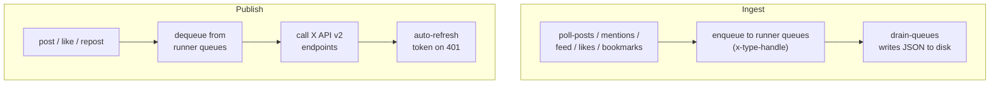

# X (Twitter) Domain

Polls, posts, and engages on X/Twitter via API v2. Supports multiple accounts with OAuth 2.0 PKCE.

## Scripts

| Script | Description |
| --- | --- |
| `poll-posts.ts` | Poll an account's own posts via X API v2 (Owned Read) |
| `poll-mentions.ts` | Poll mentions for an account |
| `poll-feed.ts` | Poll the home timeline — writes directly to feed/ directory |
| `poll-likes.ts` | Poll liked tweets for an account |
| `poll-bookmarks.ts` | Poll bookmarks for an account |
| `drain-queues.ts` | Drain all X runner queues to disk as JSON files |
| `post.ts` | Dispatch queued posts, replies, and quotes |
| `like.ts` | Process the like queue |
| `repost.ts` | Process the repost queue |
| `refresh-token.ts` | Refresh OAuth 2.0 access token (manual or scheduled) |

## Data Flow

`poll-feed` is the exception — it writes feed items directly to the account's `feed/` directory instead of using the queue pattern.

## Prerequisites

- Per-account OAuth 2.0 PKCE credentials: JSON files under `X_OAUTH_DIR` (from `constants.ts`), named `x-{handle}-oauth2.json`, each containing `clientId`, `clientSecret`, `access_token`, and `refresh_token`
- OAuth 2.0 PKCE tokens per account (generated via initial auth flow, refreshed by `refresh-token.ts`)
- Account handles configured in `X_ACCOUNTS` in `constants.ts`

## Key Dependencies

- `src/x/lib/` — X API client wrappers, OAuth token management, polling helpers
- `src/lib/constants.ts` — `X_ACCOUNTS`, `X_OAUTH_DIR`
- `src/lib/pipeline-config.ts` — additional X config references
