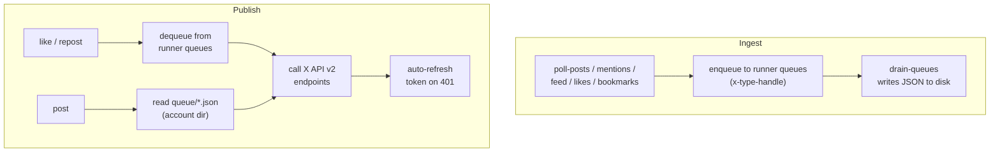

# X (Twitter) Domain

Polls, posts, and engages on X/Twitter via API v2. Supports multiple accounts with OAuth 2.0 PKCE.

## Scripts

| Script | Description |
| --- | --- |
| `poll-posts.ts` | Poll an account's own posts via X API v2 (Owned Read) |
| `poll-mentions.ts` | Poll mentions for an account |
| `poll-feed.ts` | Poll the home timeline — writes directly to feed/ directory |
| `poll-likes.ts` | Poll liked tweets for an account |
| `poll-bookmarks.ts` | Poll bookmarks for an account |
| `drain-queues.ts` | Drain all X runner queues to disk as JSON files |
| `post.ts` | Dispatch queued posts, replies, and quotes |
| `like.ts` | Process the like queue |
| `repost.ts` | Process the repost queue |
| `refresh-token.ts` | Refresh OAuth 2.0 access token (manual or scheduled) |

## Data Flow

```mermaid
flowchart TD
  subgraph Ingest
    poll["poll-posts / mentions /\nfeed / likes / bookmarks"] --> enqueue["enqueue to runner queues\n(x-type-handle)"]
    enqueue --> drain["drain-queues\nwrites JSON to disk"]
  end

  subgraph Publish
    action["like / repost"] --> dequeue["dequeue from\nrunner queues"]
    dequeue --> api["call X API v2\nendpoints"]
    post["post"] --> files["read queue/*.json\n(account dir)"]
    files --> api
    api --> refresh["auto-refresh\ntoken on 401"]
  end
```

`poll-feed` is the exception — it writes feed items directly to the account's `feed/` directory instead of using the queue pattern.

- Ingest queues are named `x-<type>-<handle>` (`x-posts-`, `x-mentions-`, `x-feed-`, `x-likes-`, `x-bookmarks-`); `drain-queues` writes each item to `<X_ACCOUNTS[handle]>/<type>/<id>.json`. `like.ts` and `repost.ts` dequeue from the runner queues `x-like-<handle>` and `x-repost-<handle>`. `post.ts` does not use a runner queue: it reads JSON files (`{ text, type?, targetTime?, replyToId?, quoteId? }`) from `<account dir>/queue/`, posts those whose `targetTime` has passed, and moves each to `queue/done/` or, after 3 failed attempts, `queue/failed/`.

## Prerequisites

- `X_ACCOUNTS` in `constants.ts` (`src/lib/constants/integrations.ts`): a map of account handle → that account's output directory. Empty in the template.
- Per-account OAuth 2.0 PKCE credentials: one JSON file per handle under `X_OAUTH_DIR` (`{CREDENTIALS_DIR}/oauth`, i.e. `/opt/jeeves/config/credentials/oauth`), named `x-{handle}-oauth2.json`, containing `clientId`, `clientSecret`, `access_token` and `refresh_token`. These are secrets: keep them in that directory, never in the repo. Tokens come from the initial auth flow and are refreshed by `refresh-token.ts` (and automatically on a 401).

## Runner Jobs

| Job                | Script              | Schedule     |
| ------------------ | ------------------- | ------------ |
| `x-poll-posts`     | `poll-posts.ts`     | Every 17 min |
| `x-poll-mentions`  | `poll-mentions.ts`  | Every 19 min |
| `x-poll-feed`      | `poll-feed.ts`      | Every 23 min |
| `x-poll-likes`     | `poll-likes.ts`     | Every 29 min |
| `x-poll-bookmarks` | `poll-bookmarks.ts` | Every 13 min |
| `x-drain-queues`   | `drain-queues.ts`   | Every 11 min |

All entries in `jobs/x.json` carry a non-null `prerequisite` (the OAuth files). `post.ts`, `like.ts`, `repost.ts` and `refresh-token.ts` are not in the manifest.

**Every script except `drain-queues` takes the account handle as its first argument** (`tsx src/x/poll-posts.ts <handle>`); without one it logs `[skip]` and exits 0, as it does when the handle's OAuth file is missing. The manifest entries pass no handle, so register the poll jobs per handle with `args: ["<handle>"]` (and a per-handle job id). `drain-queues` iterates over every handle in `X_ACCOUNTS`.

## Key Dependencies

- `src/x/lib/` — X API client wrappers, OAuth token management, polling helpers
- `src/lib/constants.ts` — `X_ACCOUNTS`, `X_OAUTH_DIR`
- `src/lib/pipeline-config.ts` — additional X config references
